# Medical Research GraphRAG - Complete Documentation

_Generated from repository documentation files and real run artifacts._

---

# Medical Research GraphRAG

Biomedical AI engineering project for medically grounded question answering using real MedMentions data and multiple RAG variants.

## Overview
This repository implements and evaluates:
- GraphRAG (Chroma baseline + Pinecone comparison)
- Agentic GraphRAG (LangGraph state machine)
- Hybrid RAG (dense + sparse biomedical retrieval)
- Corrective RAG (CRAG)
- Multimodal RAG (OCR CLI and vision extraction)
- Unified evaluation (retrieval, generation, RAG, LLM judge)
- Optional selective fine-tuning track (Unsloth + PEFT + TRL)

## Ground-Truth Policy
All documentation in this repository is grounded in:
1. Local source code under `src/` and notebook scripts under `notebooks/*.py`.
2. Real execution artifacts under `outputs/`.
3. Real run logs under `outputs/logs/` and state under `outputs/run_state/`.

No synthetic metrics or placeholder results are presented as completed outcomes.

## Real Data + Model Stack
- Dataset: `bigbio/medmentions` (real records only; no synthetic records)
- Effective corpus in latest run: 4,392 records
  - `train=2,635`, `validation=878`, `test=879`
- Embeddings: `qwen3-embedding:4b` (Ollama)
- Generator: `granite4.1:8b` (Ollama)
- Judge: `granite4.1:8b` (Ollama)
- OCR (multimodal): `glm-ocr` via `ollama run`
- Vision (multimodal): `qwen3.5:4b`

## Latest Real Run Provenance (June 22, 2026)
Primary sources:
- Run state: `outputs/run_state/full_real_pipeline.state`
- Full run log: `outputs/logs/full_real_pipeline_20260622_110834.log`
- Per-notebook logs: `outputs/logs/NB*_20260622_110834.log`

State summary (`full_real_pipeline.state`):
- Preflight + model steps: done
- NB01 through NB11: done
- `pytest_q`: done

## Exact Workflow Map

| Stage | Notebook | Primary implementation modules | Main artifacts |
|---|---|---|---|
| Data foundation | `NB01_Data_Exploration` | `src/data_pipeline.py` | `outputs/tables/nb01_*`, `outputs/figures/nb01_*` |
| Chroma GraphRAG | `NB02_Chroma_GraphRAG` | `src/chroma_retriever.py`, `src/graph_builder.py`, `src/chunking.py`, `src/embeddings.py` | `outputs/tables/nb02_*`, `outputs/figures/nb02_*` |
| Pinecone GraphRAG | `NB03_Pinecone_GraphRAG` | `src/pinecone_retriever.py` + shared graph stack | `outputs/metrics/nb03_retrieval_benchmark.json`, `outputs/tables/nb03_chroma_vs_pinecone.csv` |
| Agentic GraphRAG | `NB04_Agentic_GraphRAG` | `src/agentic_rag.py` | `outputs/metrics/nb04_agentic_demo.json`, `outputs/tables/nb04_agentic_route_summary.csv` |
| Unified evaluation | `NB05_Evaluation` | `src/evaluator.py`, `src/llm_judge.py` | `outputs/metrics/nb05_evaluation_bundle.json`, `outputs/tables/nb05_metric_summary.csv` |
| Hybrid RAG | `NB06_Hybrid_RAG` | `src/hybrid_retriever.py` | `outputs/metrics/nb06_hybrid_rag_metrics.json` |
| CRAG | `NB07_CRAG` | `src/crag_pipeline.py` | `outputs/metrics/nb07_crag_metrics.json`, `outputs/tables/nb07_crag_route_summary.csv` |
| Multimodal baseline | `NB08_Multimodal_RAG` | `src/multimodal_rag.py`, `src/multimodal_assets_pmc.py` | `outputs/metrics/nb08_multimodal_rag_metrics.json` |
| Multimodal CLI OCR | `NB09_Multimodal_RAG_OCR_CLI` | `src/multimodal_rag.py` | `outputs/metrics/nb09_multimodal_ocr_cli_metrics.json` |
| Multimodal vision | `NB10_Multimodal_RAG_Vision_Qwen` | `src/multimodal_vision_rag.py` | `outputs/metrics/nb10_multimodal_qwen_vision_metrics.json` |
| Optional fine-tune track | `NB11_Selective_Finetuning_Unsloth_PEFT_TRL` | `src/finetune_data.py`, `src/finetune_unsloth.py` | `outputs/metrics/nb11_selective_finetune_metrics.json`, `outputs/finetune/` |

## Key Results Snapshot (Latest Artifacts)

| Area | Key values |
|---|---|
| NB03 Chroma latency | p50 `5973ms`, p95 `6673ms`, p99 `6773ms` |
| NB03 Pinecone latency | p50 `9658ms`, p95 `11889ms`, p99 `14087ms` |
| NB05 baseline retrieval (`k=8`) | precision `0.0417`, recall `0.3000`, MRR `0.2162`, NDCG `0.2324` |
| NB06 hybrid retrieval (`k=8`) | precision `0.0625`, recall `0.4500`, MRR `0.3931`, NDCG `0.4101` |
| NB07 CRAG retrieval (`k=8`) | precision `0.0781`, recall `0.3750`, MRR `0.3125`, NDCG `0.3314` |
| NB08 multimodal retrieval (`k=8`) | precision `0.1250`, recall `1.0000`, MRR `1.0000`, NDCG `1.0000` |
| NB09 multimodal CLI retrieval (`k=8`) | precision `0.1250`, recall `1.0000`, MRR `1.0000`, NDCG `1.0000` |
| NB10 multimodal vision retrieval (`k=8`) | precision `0.1667`, recall `1.0000`, MRR `1.0000`, NDCG `1.0000` |
| NB11 latest trainer status | `failed` with `'LlamaAttention' object has no attribute 'apply_qkv'` |

## Environment and Execution

### Setup
```bash
cd /home/ahmad/AI/Medical-Research-GraphRAG

if [ ! -d .venv ]; then
  uv python install 3.12.10
  uv venv --python 3.12.10 .venv
fi

source .venv/bin/activate
uv sync --extra dev --extra finetune
```

### Required Ollama models
```bash
ollama pull qwen3-embedding:4b
ollama pull granite4.1:8b
ollama pull glm-ocr
ollama pull qwen3.5:4b
```

### Notebook execution scripts
- Canonical baseline: `bash scripts/execute_notebooks.sh`
- Additive notebooks: `bash scripts/execute_additional_notebooks.sh`
- Strict resumable run: `bash scripts/run_full_real_pipeline_strict.sh`

## Documentation Index
- Main handbook: `docs/handbook.md`
- Evidence ledger: `docs/evidence_ledger.md`
- Tutorial chapters: `docs/tutorials/*.md`
- Combined publication markdown: `docs/documentation.md`
- PDF: `docs/documentation.pdf`

## Current Limitations (Evidence-Based)
1. Latest NB11 metrics artifact reports training backend failure; baseline-vs-finetuned deltas are null in `comparison_payload`.
2. `BERTScore` fields are `0.0` in current metric artifacts.
3. Multimodal assets are real open biomedical/health datasets (OWID-based chart/table pipeline), not radiology/pathology imaging datasets.

## Safety Note
This is an engineering research system, not a clinical decision support product. Human clinical review and governance are required for medical deployment.

---

# Medical Research GraphRAG Handbook

This handbook documents the implemented system using the local codebase and executed artifacts as the only source of truth.

- Project root: `/home/ahmad/AI/Medical-Research-GraphRAG`
- Evidence ledger: `docs/evidence_ledger.md`
- Latest full run log: `outputs/logs/full_real_pipeline_20260622_110834.log`
- Latest run state: `outputs/run_state/full_real_pipeline.state`

## Table of Contents
1. [Getting Started](tutorials/00_getting_started.md)
2. [Data Foundation (MedMentions)](tutorials/01_data_foundation.md)
3. [Chroma GraphRAG](tutorials/02_chroma_graphrag.md)
4. [Pinecone GraphRAG](tutorials/03_pinecone_graphrag.md)
5. [Agentic GraphRAG (LangGraph)](tutorials/04_agentic_graphrag.md)
6. [Evaluation Framework](tutorials/05_evaluation.md)
7. [Hybrid RAG](tutorials/06_hybrid_rag.md)
8. [Corrective RAG (CRAG)](tutorials/07_crag.md)
9. [Multimodal RAG (OCR + Tables)](tutorials/08_multimodal_rag.md)
10. [Multimodal RAG (CLI OCR specialization)](tutorials/09_multimodal_ocr_cli.md)
11. [Multimodal RAG (Vision with qwen3.5:4b)](tutorials/10_multimodal_vision_qwen.md)
12. [Selective Fine-Tuning (Unsloth + PEFT + TRL)](tutorials/11_selective_finetuning.md)

## System Architecture

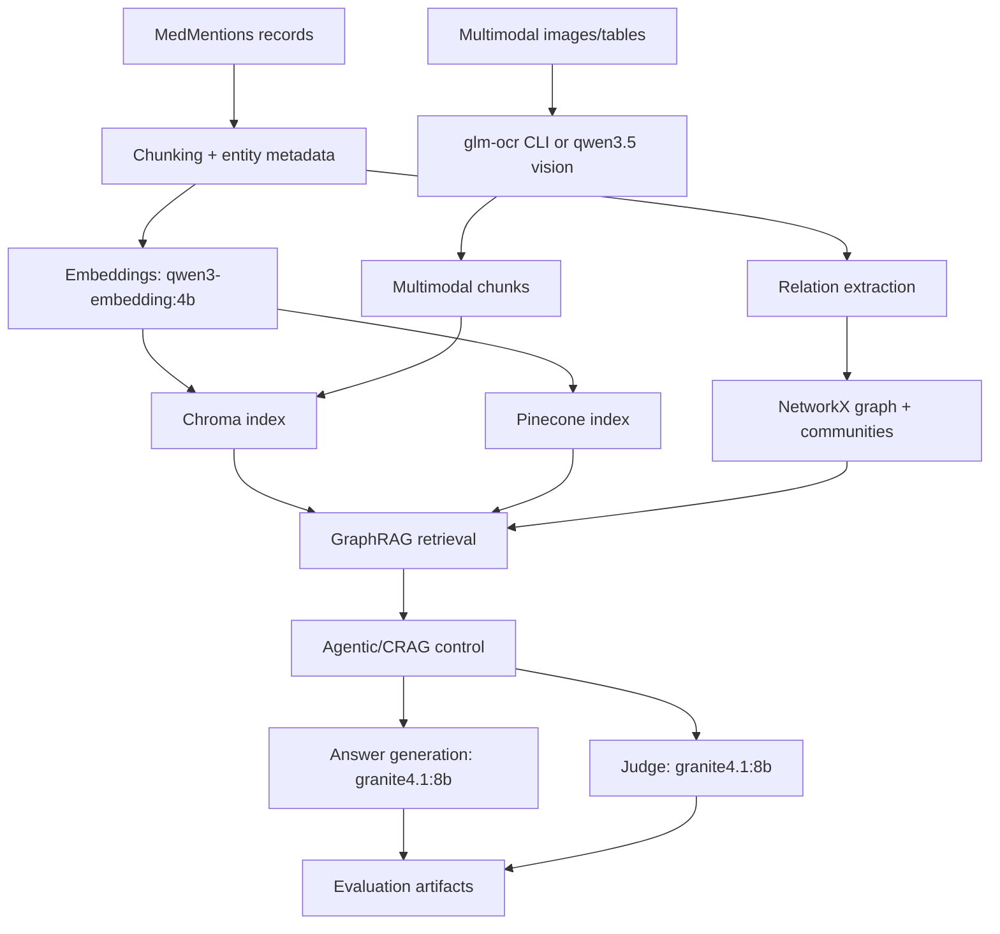

## Exact Execution Chain (Implemented)
From `scripts/run_full_real_pipeline_strict.sh`, the full strict workflow includes:
1. Environment sync (`uv sync --extra dev --extra finetune`)
2. Ollama preflight and model availability checks
3. Multimodal asset fetch
4. Notebook execution in sequence:
   - NB01, NB02, NB03, NB04, NB05, NB06, NB07, NB08, NB09, NB10, NB11
5. `pytest -q` quality gate

Resume semantics are state-driven via `outputs/run_state/full_real_pipeline.state`.

## Ground-Truth Artifact Map
- Data profiling: `outputs/tables/nb01_*`, `outputs/figures/nb01_*`
- Graph and relation outputs: `outputs/tables/nb02_*`, `outputs/figures/nb02_*`
- Chroma vs Pinecone benchmark: `outputs/metrics/nb03_retrieval_benchmark.json`, `outputs/tables/nb03_chroma_vs_pinecone.csv`
- Agentic traces: `outputs/metrics/nb04_agentic_demo.json`, `outputs/tables/nb04_agentic_route_summary.csv`
- Unified evaluation: `outputs/metrics/nb05_evaluation_bundle.json`, `outputs/tables/nb05_metric_summary.csv`
- Hybrid: `outputs/metrics/nb06_hybrid_rag_metrics.json`
- CRAG: `outputs/metrics/nb07_crag_metrics.json`, `outputs/tables/nb07_crag_route_summary.csv`
- Multimodal OCR/table: `outputs/metrics/nb08_multimodal_rag_metrics.json`
- Multimodal CLI OCR: `outputs/metrics/nb09_multimodal_ocr_cli_metrics.json`
- Multimodal vision: `outputs/metrics/nb10_multimodal_qwen_vision_metrics.json`
- Optional fine-tuning track: `outputs/metrics/nb11_selective_finetune_metrics.json`, `outputs/finetune/`

## Latest Run Summary (June 22, 2026)
From `outputs/logs/full_real_pipeline_20260622_110834.log`:
- Start: `2026-06-22 11:08:34`
- End: `2026-06-22 12:08:49`
- Resume behavior skipped previously completed steps and executed NB07-NB11 in this log window.
- `pytest -q` completed successfully (`41 passed`; warnings only).

## Metric Snapshot (latest artifacts)

| Area | Key values |
|---|---|
| NB05 baseline retrieval (`k=8`) | precision `0.0417`, recall `0.3000`, MRR `0.2162`, NDCG `0.2324` |
| NB03 Chroma latency | p50 `5973ms`, p95 `6673ms` |
| NB03 Pinecone latency | p50 `9658ms`, p95 `11889ms` |
| NB06 hybrid retrieval (`k=8`) | precision `0.0625`, recall `0.4500`, MRR `0.3931` |
| NB07 CRAG retrieval (`k=8`) | precision `0.0781`, recall `0.3750`, MRR `0.3125` |
| NB08 multimodal retrieval (`k=8`) | precision `0.1250`, recall `1.0000`, MRR `1.0000` |
| NB09 multimodal CLI retrieval (`k=8`) | precision `0.1250`, recall `1.0000`, MRR `1.0000` |
| NB10 multimodal vision retrieval (`k=8`) | precision `0.1667`, recall `1.0000`, MRR `1.0000` |
| NB11 latest trainer status | `failed` with `'LlamaAttention' object has no attribute 'apply_qkv'` |

## Practical Interpretation (Strict-Neutral)
- Baseline retrieval quality remains limited at higher-K precision.
- Hybrid retrieval shows higher recall/MRR than baseline in latest artifacts.
- CRAG provides traceable corrective routing behavior and stable judge-based relevancy in the recorded run.
- Multimodal pipelines produce high recall under the current asset/query setup.
- NB11 pipeline is implemented, but latest metrics artifact reports trainer backend failure and placeholder comparison deltas.

## Documentation Rules Used
- No synthetic metric substitution.
- No invented outputs.
- Claims are tied to concrete files under `outputs/`.
- Code behavior references are tied to `src/*.py`, `notebooks/*.py`, and `scripts/`.
- Mixed outcomes are reported as observed, without optimistic extrapolation.

## Official External References
- MedMentions dataset card: https://huggingface.co/datasets/bigbio/medmentions
- Ollama embeddings/docs: https://docs.ollama.com/capabilities/embeddings
- Ollama API: https://docs.ollama.com/api
- LangGraph docs: https://langchain-ai.github.io/langgraph/
- Chroma docs: https://docs.trychroma.com/
- Pinecone docs: https://docs.pinecone.io/
- PEFT docs: https://huggingface.co/docs/peft/index
- TRL docs: https://huggingface.co/docs/trl
- Unsloth repository/docs: https://github.com/unslothai/unsloth

---

# Evidence Ledger (Source of Truth)

This file records the exact local artifacts used as ground truth for the documentation set.

## Provenance Policy
Claims are sourced from:
1. Repository code (`src/`, `notebooks/*.py`, `scripts/`)
2. Run state and logs (`outputs/run_state/`, `outputs/logs/`)
3. Metrics/tables/figures (`outputs/metrics/`, `outputs/tables/`, `outputs/figures/`)

## Latest Full Run (Detected)
- State file: `outputs/run_state/full_real_pipeline.state`
- Latest full run log: `outputs/logs/full_real_pipeline_20260622_110834.log`
- Log window: `2026-06-22 11:08:34` to `2026-06-22 12:08:49`

### Run-state keys marked done
- preflight/model fetch steps
- NB01 through NB11 notebook steps
- pytest gate (`pytest_q`)

## Primary Metric Artifacts (latest timestamps)
- `outputs/metrics/nb03_retrieval_benchmark.json` (Jun 22, 10:03)
- `outputs/metrics/nb05_evaluation_bundle.json` (Jun 22, 10:20)
- `outputs/metrics/nb06_hybrid_rag_metrics.json` (Jun 22, 10:27)
- `outputs/metrics/nb07_crag_metrics.json` (Jun 22, 11:28)
- `outputs/metrics/nb08_multimodal_rag_metrics.json` (Jun 22, 11:37)
- `outputs/metrics/nb09_multimodal_ocr_cli_metrics.json` (Jun 22, 11:42)
- `outputs/metrics/nb10_multimodal_qwen_vision_metrics.json` (Jun 22, 11:52)
- `outputs/metrics/nb11_selective_finetune_metrics.json` (Jun 22, 12:06)

## Key Numeric Facts Referenced in Docs

### NB03 backend benchmark
- Chroma latency p50/p95/p99: `5973.14 / 6672.91 / 6773.33 ms`
- Pinecone latency p50/p95/p99: `9657.66 / 11888.92 / 14086.93 ms`

### NB05 baseline evaluation
- Retrieval (`k=8`): precision `0.0417`, recall `0.3000`, MRR `0.2162`, NDCG `0.2324`
- RAG: faithfulness `0.9458`, answer_relevancy `0.9833`

### NB06 hybrid
- Retrieval (`k=8`): precision `0.0625`, recall `0.4500`, MRR `0.3931`, NDCG `0.4101`

### NB07 CRAG
- Retrieval (`k=8`): precision `0.0781`, recall `0.3750`, MRR `0.3125`, NDCG `0.3314`

### NB08/NB09/NB10 multimodal
- NB08 (`k=8`): precision `0.1250`, recall `1.0000`, MRR `1.0000`, NDCG `1.0000`
- NB09 (`k=8`): precision `0.1250`, recall `1.0000`, MRR `1.0000`, NDCG `1.0000`
- NB10 (`k=8`): precision `0.1667`, recall `1.0000`, MRR `1.0000`, NDCG `1.0000`

### NB11 (latest metrics artifact)
- `trainer_log_summary.backend = failed`
- `trainer_log_summary.error = 'LlamaAttention' object has no attribute 'apply_qkv'`
- `comparison_payload.mode = placeholder`

## Known Artifact Tension (Documented Neutrality)
- `outputs/metrics/nb11_selective_finetune_metrics.json` reports a failed training backend in latest run.
- `outputs/finetune/adapters/medresearch-lora/` contains existing adapter files from an earlier timestamp.
- Documentation therefore treats NB11 as: implemented pipeline present, latest run comparison deltas not available.

## Script-Level Evidence
- Strict run orchestrator: `scripts/run_full_real_pipeline_strict.sh`
- Notebook order in script includes NB01 -> NB11 and a final `pytest -q` step.
- Resume semantics are driven by `outputs/run_state/full_real_pipeline.state`.

## Documentation Scope Guard
Only documentation files are modified during this documentation pass:
- `README.md`
- `docs/*.md`
- `docs/documentation.pdf`
- optional docs-only rendering intermediates under `docs/`

---

# 00. Getting Started

## What this project is
A full biomedical RAG engineering stack combining:
- GraphRAG
- Agentic RAG
- Hybrid RAG
- Corrective RAG (CRAG)
- Multimodal RAG (OCR and vision)
- Optional selective fine-tuning

All pipelines are grounded in real MedMentions records and local Ollama-hosted models.

## Why this tutorial exists
This chapter provides the operational map before deep-diving into each notebook.

## Ground-truth first
Before using results, check:
- `docs/evidence_ledger.md`
- `outputs/run_state/full_real_pipeline.state`
- latest full run log in `outputs/logs/`

## Core workflow
1. Load and normalize MedMentions records.
2. Chunk and embed with `qwen3-embedding:4b`.
3. Index in Chroma and optionally Pinecone.
4. Build graph (entities, relations, communities).
5. Run retrieval variants (baseline, hybrid, CRAG, multimodal).
6. Generate answers (`granite4.1:8b`) and judge outputs (`granite4.1:8b`).
7. Persist metrics, tables, and figures.

## Architecture diagram

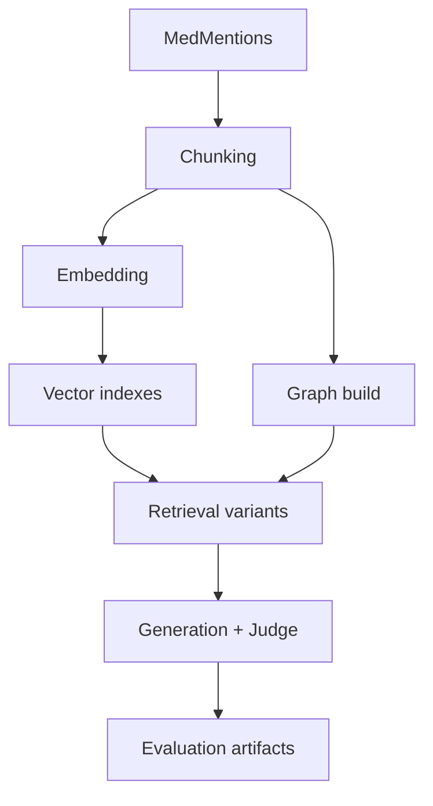

## How this appears in code
- Configuration and paths: `src/config.py`
- Data ingestion: `src/data_pipeline.py`
- Chunking: `src/chunking.py`
- Embeddings: `src/embeddings.py`
- Core notebooks: `notebooks/NB01_*.py` to `NB11_*.py`
- Strict orchestrator: `scripts/run_full_real_pipeline_strict.sh`

## Environment setup
```bash
cd /home/ahmad/AI/Medical-Research-GraphRAG

if [ ! -d .venv ]; then
  uv python install 3.12.10
  uv venv --python 3.12.10 .venv
fi

source .venv/bin/activate
uv sync --extra dev --extra finetune
```

## Required models
```bash
ollama pull qwen3-embedding:4b
ollama pull granite4.1:8b
ollama pull glm-ocr
ollama pull qwen3.5:4b
```

## Run entrypoints
- Baseline notebooks: `bash scripts/execute_notebooks.sh`
- Additive notebooks: `bash scripts/execute_additional_notebooks.sh`
- Full strict run: `bash scripts/run_full_real_pipeline_strict.sh`

## Why strict runner matters
`run_full_real_pipeline_strict.sh` adds:
- resume-aware state tracking,
- retry semantics per step,
- model preflight checks,
- full logging,
- final `pytest -q` gate.

## Real outputs to inspect
- Metrics: `outputs/metrics/*.json`
- Tables: `outputs/tables/*.csv`
- Figures: `outputs/figures/*.png`
- Execution logs: `outputs/logs/*.log`

## Production considerations
- Pin model versions across indexing/query/evaluation.
- Keep artifact lineage for every run.
- Treat logs and metrics as auditable operational evidence.

## Conclusion
Read this chapter first, then proceed through NB01 -> NB11 tutorials for the full zero-to-hero path.

---

# 01. Data Foundation (MedMentions)

## What is this technique?
This chapter covers **data foundation engineering** for medical RAG: loading, normalizing, validating, and persisting real biomedical records before retrieval or generation.

## Definition and core concepts
- **Record normalization**: mapping raw dataset schema to stable dataclasses.
- **Entity normalization**: preserving concept IDs and semantic types.
- **Extractive eval query generation**: building query/reference pairs directly from real abstract sentences.

## Why was this developed?
RAG quality is bounded by input quality. If schemas drift or annotations are inconsistent, every downstream stage degrades.

## What limitation of traditional RAG does it solve?
Many RAG demos use ad-hoc text chunks and synthetic QA pairs. This implementation avoids that by grounding evaluation and retrieval in real biomedical annotations.

## How it appears in code
- Dataclasses: `EntityMention`, `MedRecord`, `EvalQuery` in `src/data_pipeline.py` (lines 18-50)
- Loader: `load_medmentions_records` (lines 101-141)
- Query builder: `build_extractive_eval_queries` (lines 180-240)
- Persistence: `persist_records` and `persist_eval_queries` (lines 145-150, 243-249)

Notebook implementation:
- `notebooks/NB01_Data_Exploration.py`

## Architecture/workflow explanation

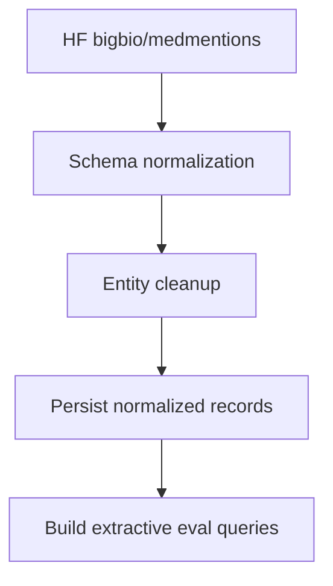

- Step A-B is implemented in `load_medmentions_records`.
- Step C uses `_normalize_entity`.
- Step E uses deterministic entity-to-sentence matching.

## Component-by-component breakdown
1. `_extract_passages` pulls title/abstract robustly from varied passage fields.
2. `_normalize_entity` standardizes offsets and semantic type lists.
3. `load_medmentions_records` aggregates all splits and applies deterministic sampling.
4. `build_extractive_eval_queries` generates grounded references from real abstract sentences.

## Real observed outputs
From `outputs/tables/nb01_split_summary.csv`:
- `train=2635`, `validation=878`, `test=879` (total 4,392)
- Average text length ~1,579-1,593 chars
- Average entity count ~80 per record

From `outputs/tables/nb01_top_concepts.csv`:
- Top CUI mentions include `C0030705` with 5,897 occurrences.

From `outputs/tables/nb01_top_semantic_types.csv`:
- Most frequent semantic types include `T080`, `T169`, `T081`.

## Why this design over alternatives
- Chosen: MedMentions because it includes UMLS concept IDs and broad biomedical coverage.
- Not chosen: narrow-domain corpora (e.g., only disease/chemical) for this graph-heavy architecture.

## When should this approach be used?
Use when you need:
- biomedical entity IDs as first-class retrieval features,
- graph construction from real concept annotations,
- reproducible eval queries with non-synthetic references.

## Advantages
- High grounding quality for eval references.
- Strong traceability from answer quality back to source records.
- Deterministic sampling and reproducible artifacts.

## Disadvantages
- More upfront preprocessing effort than plain text dumps.
- Evaluation references are extractive; may under-represent abstractive correctness.

## Comparison against standard RAG prep
- Standard prep: plain text chunks, weak entity metadata.
- This prep: concept-aware records + grounded eval references.

## Production considerations
- Version dataset slice and random seed.
- Keep schema contracts stable across notebook/script paths.
- Persist normalized artifacts for reproducibility and audit.

## Conclusion
This foundation is the reason later GraphRAG, CRAG, and multimodal evaluations remain grounded and reproducible.

---

# 02. Chroma GraphRAG

## What is this technique?
**GraphRAG** augments vector retrieval with graph structure (entities, relations, communities) so evidence retrieval is not purely embedding-similarity based.

This notebook builds the local baseline using ChromaDB.

## Definition and core concepts
- **Dense retrieval**: similarity search over chunk embeddings.
- **Entity graph**: UMLS concepts as nodes, co-occurrence/relations as edges.
- **Local search**: neighborhood expansion around query concepts.
- **Global search**: community-level routing using Louvain clusters.

## Why was GraphRAG developed?
Dense-only retrieval can miss relationship structure (e.g., treatment vs cause vs co-occurrence). GraphRAG adds explicit structural signals.

## What limitation of traditional RAG does it solve?
Traditional RAG lacks relational context and concept topology. GraphRAG provides explicit biomedical concept linking and community-level context.

## Architecture/workflow diagram

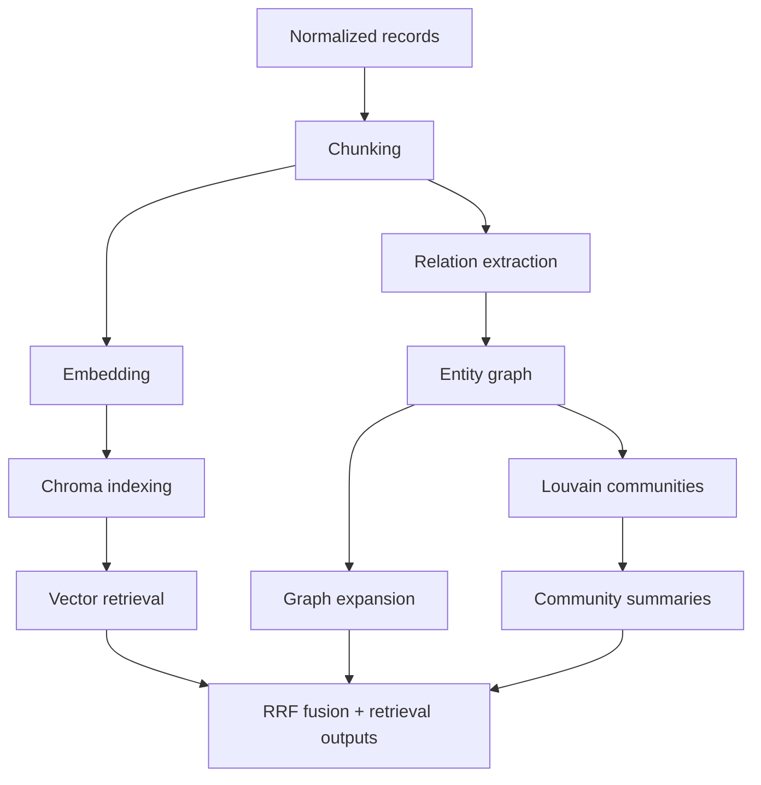

## How it appears in code
Core modules:
- Chroma indexing/search: `src/chroma_retriever.py`
  - `index_chunks_to_chromadb` (57-84)
  - `vector_search` (93-122)
  - `entity_search` (124-155)
  - `reciprocal_rank_fusion` (157-185)
- Graph build/search: `src/graph_builder.py`
  - `extract_relationship_edges` (276-313)
  - `build_entity_graph` (64-127)
  - `detect_communities` (151-160)
  - `local_graph_expansion` (200-233)
  - `rank_communities_for_query` (235-261)

Notebook implementation:
- `notebooks/NB02_Chroma_GraphRAG.py`

## Component-by-component breakdown
1. Chunking with entity metadata propagation (`src/chunking.py` lines 111-147).
2. Embedding with Ollama (`src/embeddings.py` lines 34-149).
3. Chroma persistence with rich metadata (`src/chroma_retriever.py` lines 26-36, 57-84).
4. Relation extraction heuristics (`src/graph_builder.py` lines 30-47, 276-313).
5. Graph statistics + communities (`src/graph_builder.py` lines 130-197).
6. Retrieval fusion via RRF (`src/chroma_retriever.py` lines 157-185).

## Real outputs from latest artifacts
Graph stats from `outputs/tables/nb02_graph_stats.csv`:
- Nodes: `15,454`
- Edges: `2,191,052`
- Density: `0.01835`
- Largest component: `15,454`

Relation stats from `outputs/tables/nb02_relation_stats.csv`:
- Total relation edges extracted: `4,342,106`
- Relation labels include `associated_with`, `co_occurs_with`, `inhibits`, `causes`, `activates`, `treats`

Community summary from `outputs/tables/nb02_community_summary.csv`:
- Largest communities: sizes `4,809`, `3,984`, `3,844`, `2,739`

## Why ChromaDB here?
- Local persistence, fast iteration, low ops overhead.
- Straightforward metadata retrieval for tutorial transparency.

## Why not FAISS/Weaviate/Qdrant for Section A?
- FAISS: strong ANN core but extra metadata/persistence plumbing required.
- Weaviate/Qdrant: strong production choices but add service runtime overhead for a local-first chapter.

## When should this be used?
- Early-stage prototyping with deep retrieval introspection.
- Scenarios where graph-aware biomedical expansion is required.

## Advantages
- Explainable concept-level retrieval behavior.
- Strong debugging visibility (graph stats, communities, relation labels).
- Reproducible local baseline before managed deployment.

## Disadvantages
- Heuristic relation extraction has precision limits.
- Full-collection metadata scans can be expensive at scale.

## Comparison vs standard dense RAG
- Standard dense RAG: semantic similarity only.
- Chroma GraphRAG: semantic + concept graph + community context.

## Production considerations
- Replace heuristic relation extraction with stronger relation models.
- Track graph drift and refresh schedule.
- Add retrieval latency/error telemetry around vector and graph channels.

## Conclusion
This chapter establishes the structural retrieval baseline the rest of the system builds upon.

---

# 03. Pinecone GraphRAG

## What is this technique?
This chapter ports the GraphRAG retrieval workflow to Pinecone and compares it directly with Chroma on the same corpus/chunks/queries.

## Definition and core concepts
- **Managed vector backend**: Pinecone serves vectors over a hosted service.
- **Apples-to-apples benchmark**: same embeddings, same chunk metadata, same graph expansion logic.
- **Cost proxy**: operation counts and vector footprint used as auditable cost drivers.

## Why was this developed?
A local baseline is useful, but production systems often require managed scaling, isolation, and cloud-native operations.

## What limitation of traditional single-backend RAG does it solve?
Single backend choices hide operational tradeoffs. This comparison exposes latency, complexity, and scale posture differences.

## Architecture diagram

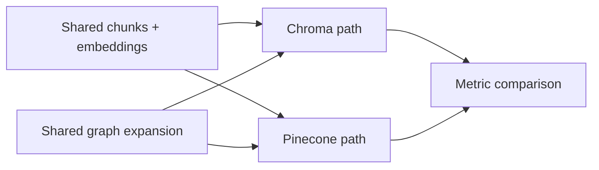

## How it appears in code
- Pinecone utilities: `src/pinecone_retriever.py`
  - `create_index` (47-63)
  - `index_chunks_to_pinecone` (76-114)
  - `query_pinecone` (116-153)
  - `pinecone_cost_proxy` (155-195)
- Notebook benchmarking logic: `notebooks/NB03_Pinecone_GraphRAG.py`

## Component breakdown
1. Rehydrate the same artifacts from NB02.
2. Index vectors in Pinecone namespace.
3. Run matched GraphRAG search path in both backends.
4. Compute retrieval metrics and latency distributions.
5. Persist comparison tables/charts.

## Real benchmark outputs
Source files:
- `outputs/metrics/nb03_retrieval_benchmark.json`
- `outputs/tables/nb03_chroma_vs_pinecone.csv`

### Latency
- Chroma: p50 `5973ms`, p95 `6673ms`, p99 `6773ms`
- Pinecone: p50 `9658ms`, p95 `11889ms`, p99 `14087ms`

### Retrieval quality snapshot
- Chroma (`k=8`): precision `0.0417`, recall `0.3000`, MRR `0.2162`, NDCG `0.2324`
- Pinecone (`k=8`): precision `0.0708`, recall `0.5167`, MRR `0.1879`, NDCG `0.2722`

### Cost/scalability proxy
From `nb03_chroma_vs_pinecone.csv`:
- Chroma cost driver: `queries=30, vectors=5098`
- Pinecone cost driver: `queries=30, upserts=5098, vectors=5098`
- Complexity scores: Chroma `2/5`, Pinecone `3/5`
- Scalability scores: Chroma `3/5`, Pinecone `5/5`

## Why Pinecone vs alternatives in this chapter?
- Chosen for managed scaling path and hosted operations.
- Not chosen alternatives in this chapter (self-hosted vector DBs) to keep backend comparison focused and reproducible.

## When should this be used?
- Production environments requiring managed vector serving.
- Teams optimizing for scaling/ops consistency over local simplicity.

## Advantages
- Cloud-managed infrastructure and scale readiness.
- Clear index lifecycle APIs.

## Disadvantages
- Higher observed latency in this run vs local Chroma.
- Requires credentials and cloud dependency.

## Comparison against standard RAG
Standard RAG often fixes one backend and ignores operational tradeoffs. This chapter makes those tradeoffs measurable.

## Production considerations
- Enforce index lifecycle cleanup for spend control.
- Monitor tail latency and retry behavior.
- Keep metadata schema consistent across stores.

## Conclusion
Pinecone integration is fully implemented and benchmarked against Chroma with real artifacts, enabling informed backend decisions.

---

# 04. Agentic GraphRAG (LangGraph)

## What is this technique?
Agentic GraphRAG uses an explicit state graph (LangGraph) to route queries through retrieval, grading, fallback, graph traversal, answer generation, and hallucination checks.

## Definition and core concepts
- **State machine RAG**: deterministic node graph over mutable state.
- **Routing gates**: branches controlled by retrieval and hallucination quality.
- **Traceability**: every node transition is recorded in `trace`.

## Why was this developed?
Linear pipelines cannot adapt when retrieval is weak. Agentic control enables controlled fallback and retry logic.

## What limitation of traditional RAG does it solve?
Traditional RAG has weak conditional behavior and limited observability. Agentic GraphRAG adds explicit branch semantics and replayable traces.

## Workflow diagram

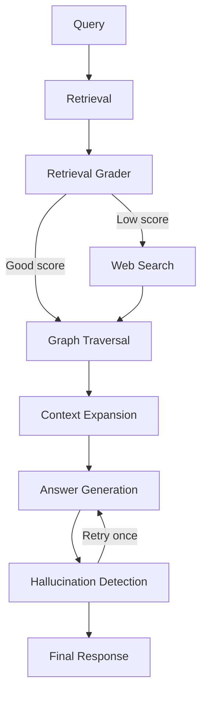

## How it appears in code
`src/agentic_rag.py`:
- State definition: `AgentState` (28-45)
- Workflow builder: `build_agentic_workflow` (182-345)
- Node implementations:
  - retrieval (185-190)
  - retrieval grader (192-197)
  - web fallback (199-202)
  - graph traversal (204-212)
  - context expansion (214-243)
  - answer generation (245-278)
  - hallucination detection (280-295)
  - finalize (297-300)

Notebook:
- `notebooks/NB04_Agentic_GraphRAG.py`

## Component breakdown
1. Retrieve top-k dense docs from Chroma.
2. Judge retrieval quality (`settings.retrieval_grade_threshold`).
3. Route to web fallback if low quality.
4. Expand graph neighborhoods + communities.
5. Generate grounded answer with citations.
6. Judge groundedness/hallucination and optionally retry once.

## Real outputs
- Workflow Mermaid artifact: `outputs/figures/nb04_agent_workflow_mermaid.md`
- Route summary: `outputs/tables/nb04_agentic_route_summary.csv`
- Demo state payload: `outputs/metrics/nb04_agentic_demo.json`

From `nb04_agentic_route_summary.csv`:
- Example query route: `graph_traversal`
- Retrieval score: `0.85`
- Hallucination score: `0.95`

## Why LangGraph over simpler chaining?
- Explicit, inspectable state graph.
- Safer branch control than ad-hoc conditionals.
- Better for audit and debugging.

## When should this be used?
- Biomedical workloads with variable retrieval quality.
- Systems requiring explainable control-flow for safety review.

## Advantages
- Strong observability via trace paths.
- Controlled fallback/retry behavior.
- Clear extension path for additional tools.

## Disadvantages
- More orchestration complexity.
- Extra judge calls increase runtime cost and latency.

## Comparison against other variants
- Standard RAG: fastest, least adaptive.
- Hybrid RAG: better retrieval but no full control graph.
- CRAG: stricter corrective policy specialization.
- Agentic GraphRAG: broader orchestration with graph-aware context.

## Production considerations
- Limit fallback domains for medical safety.
- Add node-level latency and failure telemetry.
- Enforce retry caps and timeout budgets.

## Conclusion
Agentic GraphRAG provides the control-plane layer for reliability and explainability on top of retrieval and graph evidence.

---

# 05. Evaluation Framework

## What is this technique?
A unified evaluation stack measuring:
- Retrieval quality
- Generation quality
- RAG-specific groundedness quality
- LLM-as-a-Judge quality axes

## Definition and core concepts
### Retrieval metrics
- Precision@K
- Recall@K
- F1@K
- MRR
- NDCG@K

### Generation metrics
- Exact Match
- BLEU
- ROUGE-1/2/L
- METEOR
- BERTScore

### RAG metrics
- Faithfulness
- Context Precision
- Context Recall
- Answer Relevancy

### Judge axes (granite4.1:8b)
- Groundedness
- Relevance
- Hallucination (higher = lower hallucination risk in this implementation)
- Completeness

## Why this framework was developed
Single metrics can hide failure modes. Biomedical RAG needs layered quality checks because retrieval, answer style, and groundedness can diverge.

## What limitation of traditional RAG evaluation does it solve?
Traditional evaluation often measures only lexical overlap. This framework adds retrieval diagnostics and groundedness judgment.

## How it appears in code
Core implementation in `src/evaluator.py`:
- retrieval metrics: lines 64-147
- generation metrics: lines 149-255
- judge-backed RAG metrics: lines 308-456
- unified bundle: lines 459-486

Judge helper module:
- `src/llm_judge.py` (`grade_retrieval_quality`, `grade_groundedness`)

Notebook:
- `notebooks/NB05_Evaluation.py`

## Workflow diagram

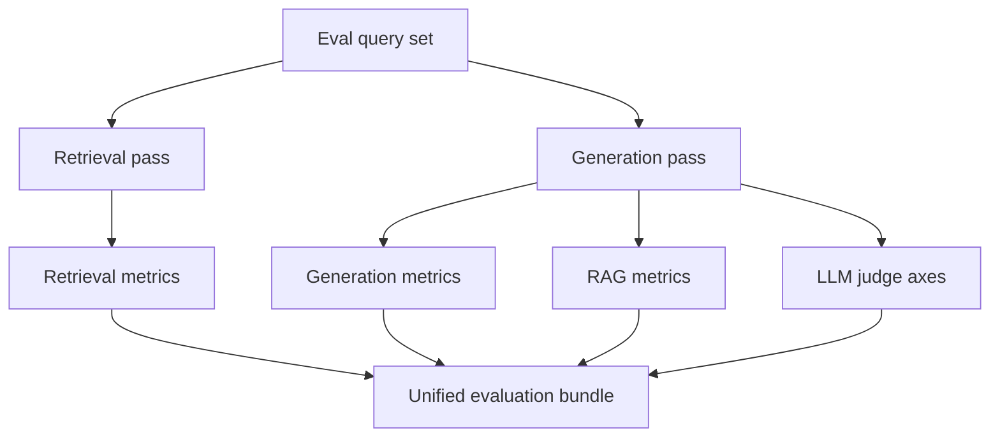

## Real outputs and values
Primary artifacts:
- `outputs/metrics/nb05_evaluation_bundle.json`
- `outputs/tables/nb05_metric_summary.csv`
- `outputs/tables/nb05_sample_agent_outputs.csv`

From latest `nb05_evaluation_bundle.json`:
- Retrieval (`k=8`): precision `0.0417`, recall `0.3000`, f1 `0.0726`, ndcg `0.2324`, mrr `0.2162`
- Generation: exact_match `0.0`, bleu `0.0126`, rouge1 `0.1420`, meteor `0.1626`
- RAG: faithfulness `0.9458`, context_precision `0.2307`, context_recall `0.2167`, answer_relevancy `0.9833`
- Judge axes: groundedness `4.4167`, relevance `5.0`, hallucination `5.0`, completeness `3.75`

## Interpretation of observed metrics
- Retrieval has room for improvement at high-K precision.
- Lexical generation metrics are modest, which is common in biomedical paraphrastic answers.
- Judge-based groundedness/relevance are relatively strong in this run.

## Advantages
- Multi-perspective quality measurement.
- Unified bundle for regression tracking.
- Judge + deterministic metrics together reduce blind spots.

## Disadvantages
- Judge metrics add runtime and potential evaluator variance.
- BERTScore can fail/fallback in constrained environments.

## Comparison against standard evaluation
- Standard: often ROUGE/BLEU only.
- This project: retrieval + generation + RAG + judge in one contract.

## Production considerations
- Keep eval set versioned and non-synthetic.
- Track trends per release, not single-point values.
- Add slice-based reporting (rare terms, long-tail diseases, modality-specific queries).

## Conclusion
This framework turns pipeline behavior into measurable, auditable signals needed for iteration and production gating.

---

# 06. Hybrid RAG (Dense + Sparse Biomedical Retrieval)

## What is this technique?
Hybrid RAG combines:
- dense semantic retrieval (`qwen3-embedding:4b` via Chroma), and
- sparse lexical retrieval (BM25-style index with biomedical abbreviation expansion)

then fuses both channels into one ranking.

## Definition and core concepts
- **Dense retrieval**: semantic nearest-neighbor similarity.
- **Sparse retrieval**: lexical term matching and BM25 scoring.
- **Fusion**: weighted normalized score merge or RRF.

## Why was this developed?
Biomedical text has both semantic and exact lexical signals (gene names, abbreviations, biomarkers). Dense-only or sparse-only retrieval misses part of this signal.

## What limitation of traditional RAG does it solve?
Traditional dense-only RAG can miss exact biomedical terms; sparse-only can miss paraphrases. Hybrid reduces both failure modes.

## Architecture diagram

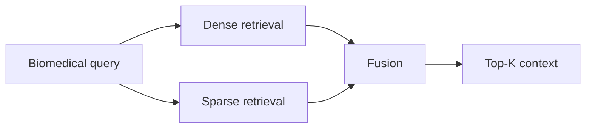

## How it appears in code
`src/hybrid_retriever.py`:
- Biomedical tokenization: `_tokenize` (30-33)
- Abbreviation expansion map: `BIOMED_ABBREVIATION_MAP` (35-42)
- Sparse index class: `BiomedicalSparseIndex` (55-163)
- Fusion: `weighted_score_fusion` (165-219)
- End-to-end search: `hybrid_search` (221-248)

Notebook:
- `notebooks/NB06_Hybrid_RAG.py`

## Component breakdown
1. Build sparse index from chunk text.
2. Query dense and sparse channels.
3. Fuse via normalized weighted scores (`settings.hybrid_dense_weight`, `settings.hybrid_sparse_weight`) or optional RRF.
4. Evaluate across retrieval/generation/RAG/judge metrics.

## Real outputs
- Metrics: `outputs/metrics/nb06_hybrid_rag_metrics.json`
- Summary table: `outputs/tables/nb06_hybrid_rag_summary.csv`

Latest key values:
- Retrieval (`k=8`): precision `0.0625`, recall `0.4500`, MRR `0.3931`, NDCG `0.4101`
- RAG: faithfulness `0.7667`, answer_relevancy `0.7833`
- Judge retrieval quality sample: `0.3` (with missing-aspects rationale in metrics JSON)

## Interpretation
Compared to baseline NB05 retrieval (`recall@8=0.3000`, `MRR=0.2162`), hybrid shows higher recall and MRR in this run.

## Why this design over alternatives?
- Weighted fusion is transparent and tunable.
- RRF remains available when score scales are incomparable.

## When should this be used?
- Biomedical corpora with abbreviations, acronyms, and exact terminology.
- Systems where dense-only retrieval underperforms on lexical precision.

## Advantages
- Better lexical-semantic balance.
- Uses existing Chroma infrastructure.
- Simple to inspect and tune.

## Disadvantages
- Extra index and tuning overhead.
- Potential latency increase from dual retrieval channels.

## Comparison against implemented variants
- Standard GraphRAG: strong structure, weaker lexical compensation.
- Hybrid: retrieval quality booster layer.
- CRAG: correction layer on top when retrieval still weak.

## Production considerations
- Track query cohorts where sparse contributes most.
- Version and monitor fusion weights.
- Rebuild sparse index when corpus updates.

## Conclusion
Hybrid retrieval is a practical middle-ground improvement before moving to heavier reranking architectures.

---

# 07. Corrective RAG (CRAG)

## What is this technique?
CRAG is a quality-gated RAG controller that:
1. grades retrieval quality,
2. corrects the query when quality is low,
3. falls back to web evidence when retries are exhausted,
4. verifies groundedness before finalizing.

## Definition and core concepts
- **Retrieval grader**: judge-based quality score.
- **Corrective loop**: bounded query rewrite + re-retrieval attempts.
- **Fallback path**: external evidence retrieval.
- **Verification gate**: groundedness check after generation.

## Why was this developed?
In biomedical QA, weak retrieval can silently propagate into hallucinated outputs. CRAG makes retrieval quality a first-class control signal.

## What limitation of traditional RAG does it solve?
Traditional RAG often has no explicit correction policy when retrieval is poor. CRAG introduces deterministic routing and bounded recovery behavior.

## CRAG workflow diagram

```mermaid
flowchart TD
    A[Query] --> B[Hybrid retrieval]
    B --> C[Retrieval grader]
    C -->|Accept| D[Context expansion]
    C -->|Correct| E[Query rewrite]
    E --> B
    C -->|Fallback| F[Web fallback]
    F --> D
    D --> G[Answer generation]
    G --> H[Grounding verification]
    H -->|Grounded| I[Finalize]
    H -->|Not grounded (bounded)| F
```

## How it appears in code
`src/crag_pipeline.py`:
- State and resources: `CRAGState`, `CRAGResources` (20-48)
- Query rewrite: `_rewrite_query_with_llm` (72-100)
- Workflow assembly: `build_crag_workflow` (102-267)
- Run helpers: `run_crag_query`, `run_crag_batch` (269-298)

Dependencies:
- Hybrid retrieval from `src/hybrid_retriever.py`
- Judge grading from `src/llm_judge.py`

Notebook:
- `notebooks/NB07_CRAG.py`

## Component-by-component breakdown
1. Retrieve via hybrid dense+sparse channel.
2. Grade retrieval quality (`retrieval_quality` + missing aspects).
3. Route to accept/correct/fallback.
4. Build context and generate answer.
5. Verify groundedness; optionally one fallback retry.
6. Persist route traces.

## Real outputs
- Metrics: `outputs/metrics/nb07_crag_metrics.json`
- Route table: `outputs/tables/nb07_crag_route_summary.csv`

Latest key values:
- Retrieval (`k=8`): precision `0.0781`, recall `0.3750`, MRR `0.3125`, NDCG `0.3314`
- RAG: faithfulness `0.8938`, answer_relevancy `0.9813`

Route examples from `nb07_crag_route_summary.csv`:
- Diabetes query: direct finalize route, no corrections.
- KRAS pancreatic query: 2 query corrections + web fallback + verify retry before finalize.

## Why CRAG over simpler alternatives?
- Better reliability than one-pass RAG.
- More auditable than ad-hoc retries.

## When should this be used?
- High-risk domains needing explicit fallback/verification behavior.
- Environments where retrieval quality varies significantly by query type.

## Advantages
- Transparent and bounded correction policy.
- Strong traceability for postmortem/debug.

## Disadvantages
- Increased latency and model-call cost.
- Requires threshold tuning (`crag_acceptance_threshold`, `crag_max_corrections`).

## Comparison against other implemented variants
- Hybrid improves retrieval quality.
- CRAG improves reliability when retrieval is still weak.
- Agentic GraphRAG offers broader orchestration; CRAG is stricter corrective policy.

## Production considerations
- Monitor route frequencies (`accept`, `correct`, `web_fallback`).
- Keep correction and verification limits bounded.
- Restrict fallback sources for medical safety requirements.

## Conclusion
CRAG provides a reliability control plane that is explicit, measurable, and suitable for medically grounded QA pipelines.

---

# 08. Multimodal RAG (OCR + Tables)

## What is this technique?
Multimodal RAG extends text RAG by converting images and tables into retrievable text evidence.

In this project:
- image evidence is extracted via `glm-ocr` (CLI-first with fallback),
- table evidence is converted to structured narrative text,
- all evidence is indexed in Chroma and evaluated like other RAG variants.

## Definition and core concepts
- **Multimodal document**: text extracted from image/table with provenance metadata.
- **Multimodal chunk**: retrievable chunk from extracted evidence.
- **Provenance**: source path, modality, backend, model recorded in metadata.

## Why was this developed?
Biomedical findings are often in plots and tables, not only prose. Text-only RAG can miss this evidence.

## What limitation of traditional RAG does it solve?
Traditional RAG ignores non-text evidence by default. Multimodal ingestion captures chart/table signals as retrieval context.

## Architecture diagram

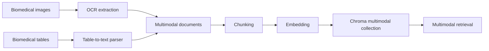

## How it appears in code
- Asset acquisition: `src/multimodal_assets_pmc.py`
  - fetches real open biomedical/health datasets and builds assets (285-348)
- OCR and multimodal ingestion: `src/multimodal_rag.py`
  - OCR wrapper: `extract_text_with_glm_ocr_with_backend` (89-164)
  - table parser: `table_to_biomedical_text` (185-224)
  - document builder: `build_multimodal_documents` (227-297)
  - indexing/search: `index_multimodal_chunks_to_chromadb` (336-362), `multimodal_vector_search` (364-391)

Notebook:
- `notebooks/NB08_Multimodal_RAG.py`

## Component breakdown
1. Fetch/build multimodal assets and manifest.
2. OCR image assets, parse table assets.
3. Build multimodal docs and chunks.
4. Index in dedicated multimodal collection.
5. Run retrieval/generation/RAG/judge evaluation.

## Real outputs
- Metrics: `outputs/metrics/nb08_multimodal_rag_metrics.json`
- Table summary: `outputs/tables/nb08_multimodal_rag_summary.csv`

Latest key values:
- Retrieval (`k=8`): precision `0.1250`, recall `1.0000`, MRR `1.0000`, NDCG `1.0000`
- Generation: BLEU `0.0184`, ROUGE-1 `0.1591`, METEOR `0.2612`
- RAG: faithfulness `0.8875`, answer_relevancy `0.9375`
- Asset counts: images `5`, tables `3`, documents `8`, chunks `8`, eval queries `8`

## Why this design vs alternatives?
- OCR+table conversion is transparent and auditable.
- It integrates with existing text retrieval stack without replacing infrastructure.

## When should this be used?
- Chart-heavy/table-heavy biomedical QA tasks.
- Use cases requiring numeric trend/context evidence.

## Advantages
- Brings visual/tabular evidence into standard RAG pipeline.
- Maintains provenance and retrieval traceability.

## Disadvantages
- OCR noise and preprocessing complexity.
- Quality depends on image/table quality and parsing robustness.

## Comparison against other variants
- NB08 provides general multimodal baseline.
- NB09 specializes operational OCR pathway.
- NB10 specializes non-text visual semantics via vision model.

## Production considerations
- Version extracted text with source assets.
- Add OCR quality checks and confidence filters.
- Enforce data governance for sensitive medical assets.

## Conclusion
Multimodal ingestion materially expands available evidence beyond text-only abstracts and improves retrieval coverage in visual/table scenarios.

---

# 09. Multimodal RAG (CLI OCR Specialization)

## What is this technique?
This chapter focuses on a **CLI-first OCR operational pattern**:
- primary path: `ollama run glm-ocr`
- fallback path: `ollama.chat` only on CLI failure

The goal is operational transparency and reproducibility of OCR execution.

## Definition and core concepts
- **CLI-first extraction**: OCR executed as subprocess with explicit command and timeout.
- **Backend provenance**: each asset stores whether extraction came from CLI or fallback.
- **Bounded fallback**: retry-controlled recovery path.

## Why was this developed?
Shell-driven data pipelines often require explicit commands, logs, and retry policies. CLI-first OCR is easier to audit in those environments.

## What limitation of standard multimodal RAG does it solve?
API-only extraction can hide operational details. CLI-first execution makes OCR behavior explicit and easier to monitor.

## Workflow diagram

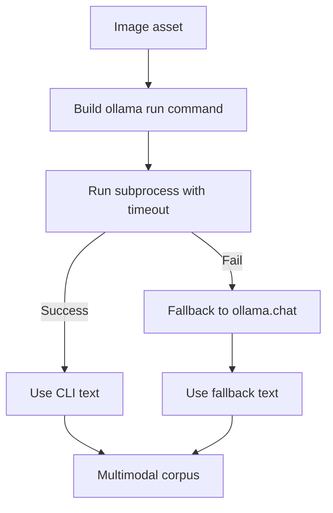

## How it appears in code
`src/multimodal_rag.py`:
- CLI command builder: `_glm_ocr_cli_command` (72-86)
- CLI + fallback executor: `extract_text_with_glm_ocr_with_backend` (89-164)
- wrapper: `extract_text_with_glm_ocr` (167-182)

Notebook:
- `notebooks/NB09_Multimodal_RAG_OCR_CLI.py`

## Component breakdown
1. Build deterministic `ollama run` command.
2. Execute with timeout and return-code checks.
3. Route to fallback only when needed.
4. Persist backend metadata with each multimodal document.

## Real outputs
- Metrics: `outputs/metrics/nb09_multimodal_ocr_cli_metrics.json`
- Summary table: `outputs/tables/nb09_multimodal_ocr_cli_summary.csv`

Latest key values:
- Retrieval (`k=8`): precision `0.1250`, recall `1.0000`, MRR `1.0000`, NDCG `1.0000`
- RAG: faithfulness `1.0000`, answer_relevancy `1.0000`
- Judge axes: groundedness/relevance/hallucination/completeness all `5.0`
- Config notes recorded in artifact:
  - `ocr_model=glm-ocr`
  - `ocr_cli_timeout_seconds=120`
  - `ocr_cli_allow_fallback=true`

## Why this design over alternatives?
- Explicit subprocess behavior is easier to debug than opaque API-only behavior.
- Fallback preserves robustness without making fallback the default path.

## When should this be used?
- Shell-oriented ETL pipelines.
- Teams requiring command-level OCR auditability.

## Advantages
- Strong operational visibility.
- Controlled failure/recovery behavior.

## Disadvantages
- More subprocess orchestration complexity.
- Requires careful timeout and retry policy tuning.

## Comparison with other multimodal variants
- NB08: broader multimodal baseline.
- NB09: operational OCR reliability focus.
- NB10: vision semantics focus beyond OCR text extraction.

## Production considerations
- Log per-asset backend route (`ollama_run` vs fallback).
- Track timeout/failure rates as quality signals.
- Keep OCR model/version pinned for reproducibility.

## Conclusion
CLI-first OCR provides a practical and auditable multimodal ingestion mode for production-like pipelines.

---

# 10. Multimodal RAG (Vision with `qwen3.5:4b`)

## What is this technique?
A second multimodal pipeline that extracts biomedical evidence from images using a vision model (`qwen3.5:4b`) instead of OCR-only extraction.

## Definition and core concepts
- **Vision extraction**: model interprets visual structure and trends, not only visible text.
- **Vision-derived evidence**: output is converted to retrievable text chunks.
- **Collection isolation**: vision outputs are indexed in a dedicated collection for clean comparison.

## Why was this developed?
OCR captures visible text but can miss chart semantics (trend direction, visual progression, subgroup patterns).

## What limitation of traditional/multimodal OCR-only RAG does it solve?
It captures non-verbatim visual meaning that text-only and OCR-only paths may miss.

## Workflow diagram

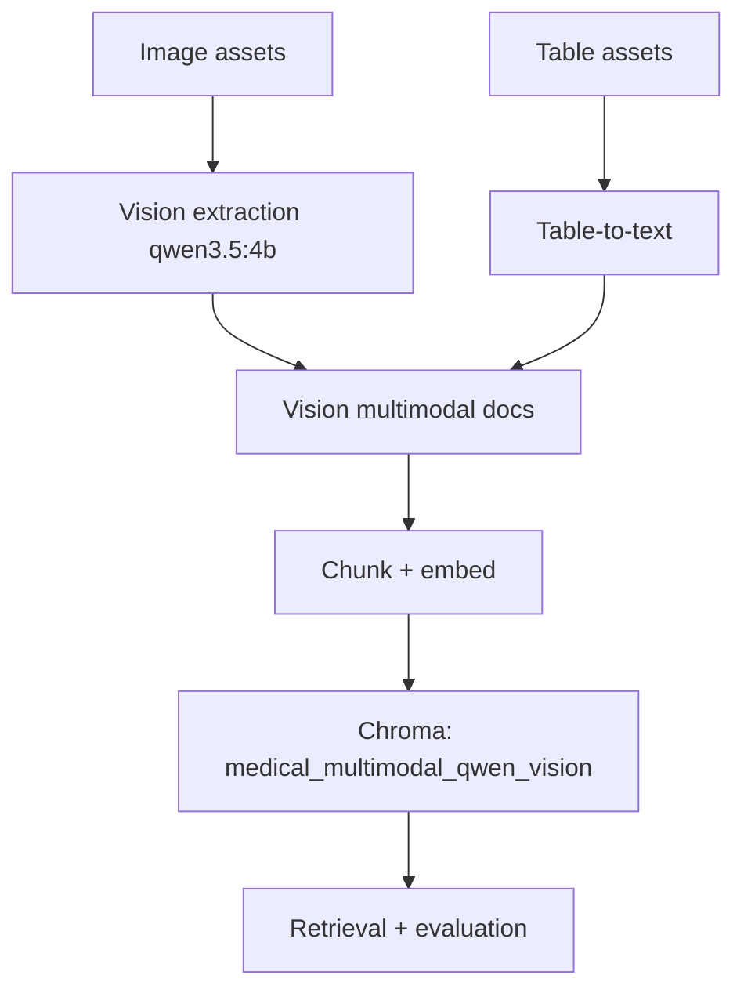

## How it appears in code
`src/multimodal_vision_rag.py`:
- Vision extraction call: `extract_vision_evidence_with_qwen` (35-84)
- Document builder: `build_vision_multimodal_documents` (87-144)
- Retrieval wrapper: `vision_multimodal_search` (174-183)

Notebook:
- `notebooks/NB10_Multimodal_RAG_Vision_Qwen.py`

## Component breakdown
1. Discover assets from `data/multimodal/images` and `data/multimodal/tables`.
2. Extract image semantics via `ollama.chat` using vision model.
3. Convert tables to text.
4. Chunk/index in dedicated vision collection.
5. Evaluate with same metric families as other chapters.

## Real outputs
- Metrics: `outputs/metrics/nb10_multimodal_qwen_vision_metrics.json`
- Summary: `outputs/tables/nb10_multimodal_qwen_vision_summary.csv`

Latest key values:
- Retrieval (`k=8`): precision `0.1667`, recall `1.0000`, MRR `1.0000`, NDCG `1.0000`
- RAG: faithfulness `0.9875`, context_recall `1.0000`, answer_relevancy `0.9750`
- Judge axes: groundedness `4.75`, relevance `5.0`, hallucination `5.0`, completeness `5.0`

## Why this design over alternatives?
- Keeps multimodal architecture consistent while swapping only extraction strategy.
- Enables direct OCR-vs-vision comparison without changing downstream evaluation.

## When should this be used?
- Figure-heavy medical tasks where trend/shape interpretation matters.
- Cases where OCR text is sparse but visual pattern is strong.

## Advantages
- Captures non-textual visual semantics.
- Shares same retrieval/evaluation contracts with other variants.

## Disadvantages
- More prompt-sensitive than OCR.
- Potentially higher inference cost and latency.

## Comparison with implemented variants
- NB09 excels in operational OCR traceability.
- NB10 excels when chart semantics matter beyond visible text.

## Production considerations
- Version prompts and extraction templates.
- Monitor vision extraction drift and hallucination risk.
- Keep separate benchmark suites for OCR and vision paths.

## Conclusion
The vision pathway broadens evidence capture for visual biomedical signals and complements OCR-based multimodal retrieval.

---

# 11. Selective Fine-Tuning (Unsloth + PEFT + TRL)

## What is this technique?
Selective fine-tuning is an optional quality-improvement path that adapts the generator model using parameter-efficient adapters instead of full model retraining.

## Definition and core concepts
- **Unsloth**: efficient model-loading/training runtime for adapter workflows.
- **PEFT (LoRA)**: train small adapter parameters while keeping base model mostly frozen.
- **TRL (SFTTrainer)**: standardized supervised fine-tuning trainer loop.

## Why was this developed?
Full-model fine-tuning is expensive and operationally heavy. This stack exists to make adaptation cheaper and more practical.

## What limitation of traditional RAG does it solve?
Even with strong retrieval, generation style and policy adherence may still be weak. Selective fine-tuning targets generator behavior without redesigning retrieval architecture.

## Why these tools were used in this project
- Unsloth: selected as preferred efficient path when compatible.
- PEFT: required for adapter-based fine-tuning (lower compute/memory than full fine-tune).
- TRL: used for trainer abstraction and reproducible SFT config.

## Where they are used in code
- Dataset construction: `src/finetune_data.py`
  - `build_biomedical_sft_examples` (56-111)
  - `persist_sft_jsonl` (149-187)
- Training utilities: `src/finetune_unsloth.py`
  - stack checks: `finetune_stack_status` (21-25)
  - Unsloth path: `create_unsloth_lora_model` (114-143)
  - PEFT fallback: `create_peft_lora_model_fallback` (145-184)
  - TRL trainer factory: `create_sft_trainer` (201-283)

Notebook implementation:
- `notebooks/NB11_Selective_Finetuning_Unsloth_PEFT_TRL.py`

## Workflow diagram

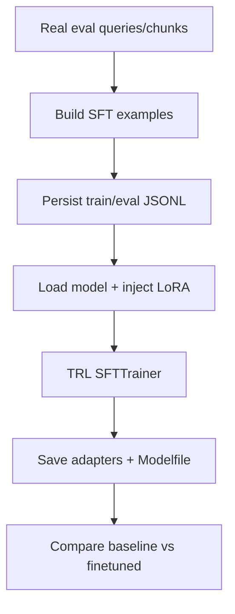

## What changed because of this implementation
- Added an optional end-to-end fine-tuning path without modifying baseline retrieval/agentic pipelines.
- Added SFT dataset and adapter artifact outputs under `outputs/finetune/`.
- Added NB11 metrics/report schema to keep comparisons consistent with other chapters.

## Real observed outputs (latest run)
Primary artifact:
- `outputs/metrics/nb11_selective_finetune_metrics.json`

Latest values from that file:
- `mode: executed`
- `stack.unsloth/peft/trl: true`
- dataset sizes: `train=2500`, `eval=300`
- training config base model: `unsloth/llama-3.2-3b-instruct`
- `trainer_log_summary.status: failed`
- error: `'LlamaAttention' object has no attribute 'apply_qkv'`
- `comparison_payload.mode: placeholder` (no deltas populated)

Additional observed artifact state:
- `outputs/finetune/adapters/medresearch-lora/` contains adapter files timestamped **June 21, 2026**, with metadata referencing `sshleifer/tiny-gpt2`.
- This indicates historical adapter artifacts exist, but the **latest June 22 metrics artifact** reports a failed training backend and no updated comparison deltas.

## How this affected post-run results
From the latest metrics artifact:
- No reliable baseline-vs-finetuned delta was produced (all delta fields null in `comparison_payload`).
- Therefore, no measured quality improvement can be claimed from the latest run.

## Performance/efficiency/quality impact in this run
- Efficiency intent: adapter tuning instead of full-model training.
- Actual latest run outcome: training backend incompatibility, so no post-run quality gain was measured.

## Advantages
- Keeps fine-tuning optional and isolated.
- Adapter-based path is lower-cost than full model tuning.
- Preserves baseline architecture unchanged.

## Disadvantages
- Compatibility risks across model/runtime combinations.
- Additional lifecycle burden (training infra, adapter governance, regression checks).

## Comparison against other implemented variants
- Hybrid/CRAG/multimodal improve retrieval/context behavior.
- NB11 targets generator adaptation and should be used only after retrieval quality is stable.

## Production considerations
- Treat adapter builds as versioned deployable artifacts.
- Add strict regression gates before replacing baseline generator.
- Keep rollback path to baseline generator always available.

## Official references used
- Unsloth: https://github.com/unslothai/unsloth
- PEFT: https://huggingface.co/docs/peft/index
- TRL: https://huggingface.co/docs/trl/index

## Conclusion
The selective fine-tuning pipeline is implemented and integrated, but the latest execution artifact records a trainer compatibility failure, so final quality deltas are not available for that run.
