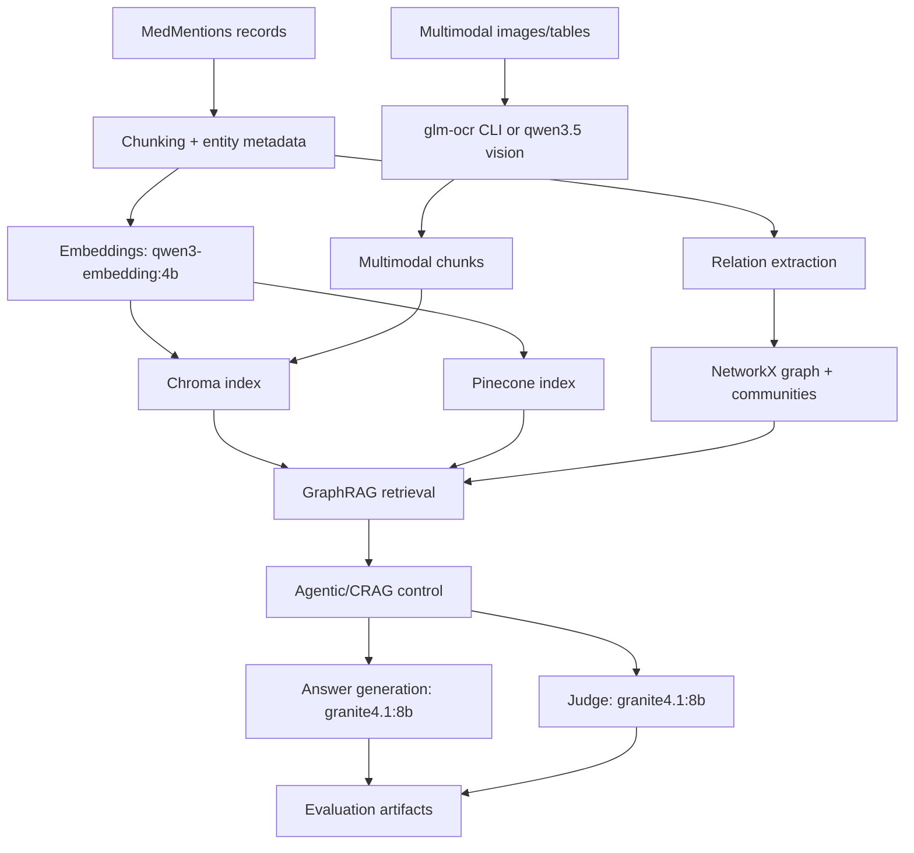

# Medical Research GraphRAG Handbook

This handbook documents the implemented system using the local codebase and executed artifacts as the only source of truth.

- Project root: `/home/ahmad/AI/Medical-Research-GraphRAG`
- Evidence ledger: `docs/evidence_ledger.md`
- Latest full run log: `outputs/logs/full_real_pipeline_20260622_110834.log`
- Latest run state: `outputs/run_state/full_real_pipeline.state`

## Table of Contents
1. [Getting Started](tutorials/00_getting_started.md)
2. [Data Foundation (MedMentions)](tutorials/01_data_foundation.md)
3. [Chroma GraphRAG](tutorials/02_chroma_graphrag.md)
4. [Pinecone GraphRAG](tutorials/03_pinecone_graphrag.md)
5. [Agentic GraphRAG (LangGraph)](tutorials/04_agentic_graphrag.md)
6. [Evaluation Framework](tutorials/05_evaluation.md)
7. [Hybrid RAG](tutorials/06_hybrid_rag.md)
8. [Corrective RAG (CRAG)](tutorials/07_crag.md)
9. [Multimodal RAG (OCR + Tables)](tutorials/08_multimodal_rag.md)
10. [Multimodal RAG (CLI OCR specialization)](tutorials/09_multimodal_ocr_cli.md)
11. [Multimodal RAG (Vision with qwen3.5:4b)](tutorials/10_multimodal_vision_qwen.md)
12. [Selective Fine-Tuning (Unsloth + PEFT + TRL)](tutorials/11_selective_finetuning.md)

## System Architecture

## Exact Execution Chain (Implemented)
From `scripts/run_full_real_pipeline_strict.sh`, the full strict workflow includes:
1. Environment sync (`uv sync --extra dev --extra finetune`)
2. Ollama preflight and model availability checks
3. Multimodal asset fetch
4. Notebook execution in sequence:
   - NB01, NB02, NB03, NB04, NB05, NB06, NB07, NB08, NB09, NB10, NB11
5. `pytest -q` quality gate

Resume semantics are state-driven via `outputs/run_state/full_real_pipeline.state`.

## Ground-Truth Artifact Map
- Data profiling: `outputs/tables/nb01_*`, `outputs/figures/nb01_*`
- Graph and relation outputs: `outputs/tables/nb02_*`, `outputs/figures/nb02_*`
- Chroma vs Pinecone benchmark: `outputs/metrics/nb03_retrieval_benchmark.json`, `outputs/tables/nb03_chroma_vs_pinecone.csv`
- Agentic traces: `outputs/metrics/nb04_agentic_demo.json`, `outputs/tables/nb04_agentic_route_summary.csv`
- Unified evaluation: `outputs/metrics/nb05_evaluation_bundle.json`, `outputs/tables/nb05_metric_summary.csv`
- Hybrid: `outputs/metrics/nb06_hybrid_rag_metrics.json`
- CRAG: `outputs/metrics/nb07_crag_metrics.json`, `outputs/tables/nb07_crag_route_summary.csv`
- Multimodal OCR/table: `outputs/metrics/nb08_multimodal_rag_metrics.json`
- Multimodal CLI OCR: `outputs/metrics/nb09_multimodal_ocr_cli_metrics.json`
- Multimodal vision: `outputs/metrics/nb10_multimodal_qwen_vision_metrics.json`
- Optional fine-tuning track: `outputs/metrics/nb11_selective_finetune_metrics.json`, `outputs/finetune/`

## Latest Run Summary (June 22, 2026)
From `outputs/logs/full_real_pipeline_20260622_110834.log`:
- Start: `2026-06-22 11:08:34`
- End: `2026-06-22 12:08:49`
- Resume behavior skipped previously completed steps and executed NB07-NB11 in this log window.
- `pytest -q` completed successfully (`41 passed`; warnings only).

## Metric Snapshot (latest artifacts)

| Area | Key values |
|---|---|
| NB05 baseline retrieval (`k=8`) | precision `0.0417`, recall `0.3000`, MRR `0.2162`, NDCG `0.2324` |
| NB03 Chroma latency | p50 `5973ms`, p95 `6673ms` |
| NB03 Pinecone latency | p50 `9658ms`, p95 `11889ms` |
| NB06 hybrid retrieval (`k=8`) | precision `0.0625`, recall `0.4500`, MRR `0.3931` |
| NB07 CRAG retrieval (`k=8`) | precision `0.0781`, recall `0.3750`, MRR `0.3125` |
| NB08 multimodal retrieval (`k=8`) | precision `0.1250`, recall `1.0000`, MRR `1.0000` |
| NB09 multimodal CLI retrieval (`k=8`) | precision `0.1250`, recall `1.0000`, MRR `1.0000` |
| NB10 multimodal vision retrieval (`k=8`) | precision `0.1667`, recall `1.0000`, MRR `1.0000` |
| NB11 latest trainer status | `failed` with `'LlamaAttention' object has no attribute 'apply_qkv'` |

## Practical Interpretation (Strict-Neutral)
- Baseline retrieval quality remains limited at higher-K precision.
- Hybrid retrieval shows higher recall/MRR than baseline in latest artifacts.
- CRAG provides traceable corrective routing behavior and stable judge-based relevancy in the recorded run.
- Multimodal pipelines produce high recall under the current asset/query setup.
- NB11 pipeline is implemented, but latest metrics artifact reports trainer backend failure and placeholder comparison deltas.

## Documentation Rules Used
- No synthetic metric substitution.
- No invented outputs.
- Claims are tied to concrete files under `outputs/`.
- Code behavior references are tied to `src/*.py`, `notebooks/*.py`, and `scripts/`.
- Mixed outcomes are reported as observed, without optimistic extrapolation.

## Official External References
- MedMentions dataset card: https://huggingface.co/datasets/bigbio/medmentions
- Ollama embeddings/docs: https://docs.ollama.com/capabilities/embeddings
- Ollama API: https://docs.ollama.com/api
- LangGraph docs: https://langchain-ai.github.io/langgraph/
- Chroma docs: https://docs.trychroma.com/
- Pinecone docs: https://docs.pinecone.io/
- PEFT docs: https://huggingface.co/docs/peft/index
- TRL docs: https://huggingface.co/docs/trl
- Unsloth repository/docs: https://github.com/unslothai/unsloth
