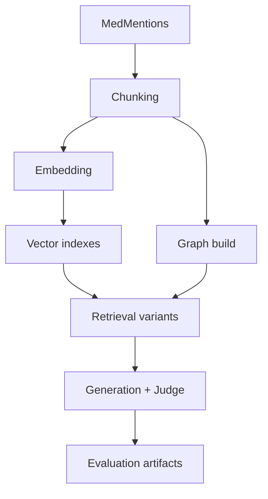

# 00. Getting Started

## What this project is
A full biomedical RAG engineering stack combining:
- GraphRAG
- Agentic RAG
- Hybrid RAG
- Corrective RAG (CRAG)
- Multimodal RAG (OCR and vision)
- Optional selective fine-tuning

All pipelines are grounded in real MedMentions records and local Ollama-hosted models.

## Why this tutorial exists
This chapter provides the operational map before deep-diving into each notebook.

## Ground-truth first
Before using results, check:
- `docs/evidence_ledger.md`
- `outputs/run_state/full_real_pipeline.state`
- latest full run log in `outputs/logs/`

## Core workflow
1. Load and normalize MedMentions records.
2. Chunk and embed with `qwen3-embedding:4b`.
3. Index in Chroma and optionally Pinecone.
4. Build graph (entities, relations, communities).
5. Run retrieval variants (baseline, hybrid, CRAG, multimodal).
6. Generate answers (`granite4.1:8b`) and judge outputs (`granite4.1:8b`).
7. Persist metrics, tables, and figures.

## Architecture diagram



## How this appears in code
- Configuration and paths: `src/config.py`
- Data ingestion: `src/data_pipeline.py`
- Chunking: `src/chunking.py`
- Embeddings: `src/embeddings.py`
- Core notebooks: `notebooks/NB01_*.py` to `NB11_*.py`
- Strict orchestrator: `scripts/run_full_real_pipeline_strict.sh`

## Environment setup
```bash
cd /home/ahmad/AI/Medical-Research-GraphRAG

if [ ! -d .venv ]; then
  uv python install 3.12.10
  uv venv --python 3.12.10 .venv
fi

source .venv/bin/activate
uv sync --extra dev --extra finetune
```

## Required models
```bash
ollama pull qwen3-embedding:4b
ollama pull granite4.1:8b
ollama pull glm-ocr
ollama pull qwen3.5:4b
```

## Run entrypoints
- Baseline notebooks: `bash scripts/execute_notebooks.sh`
- Additive notebooks: `bash scripts/execute_additional_notebooks.sh`
- Full strict run: `bash scripts/run_full_real_pipeline_strict.sh`

## Why strict runner matters
`run_full_real_pipeline_strict.sh` adds:
- resume-aware state tracking,
- retry semantics per step,
- model preflight checks,
- full logging,
- final `pytest -q` gate.

## Real outputs to inspect
- Metrics: `outputs/metrics/*.json`
- Tables: `outputs/tables/*.csv`
- Figures: `outputs/figures/*.png`
- Execution logs: `outputs/logs/*.log`

## Production considerations
- Pin model versions across indexing/query/evaluation.
- Keep artifact lineage for every run.
- Treat logs and metrics as auditable operational evidence.

## Conclusion
Read this chapter first, then proceed through NB01 -> NB11 tutorials for the full zero-to-hero path.
