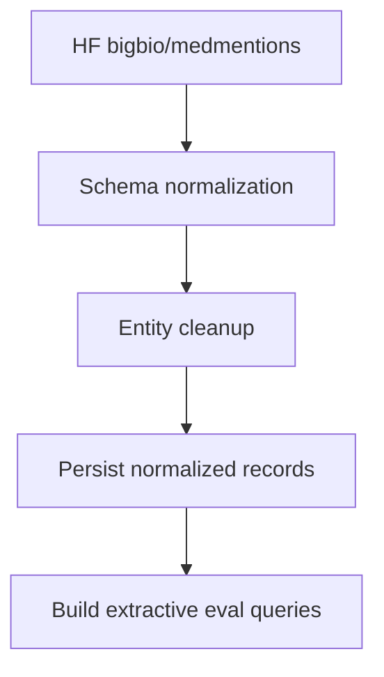

# 01. Data Foundation (MedMentions)

## What is this technique?
This chapter covers **data foundation engineering** for medical RAG: loading, normalizing, validating, and persisting real biomedical records before retrieval or generation.

## Definition and core concepts
- **Record normalization**: mapping raw dataset schema to stable dataclasses.
- **Entity normalization**: preserving concept IDs and semantic types.
- **Extractive eval query generation**: building query/reference pairs directly from real abstract sentences.

## Why was this developed?
RAG quality is bounded by input quality. If schemas drift or annotations are inconsistent, every downstream stage degrades.

## What limitation of traditional RAG does it solve?
Many RAG demos use ad-hoc text chunks and synthetic QA pairs. This implementation avoids that by grounding evaluation and retrieval in real biomedical annotations.

## How it appears in code
- Dataclasses: `EntityMention`, `MedRecord`, `EvalQuery` in `src/data_pipeline.py` (lines 18-50)
- Loader: `load_medmentions_records` (lines 101-141)
- Query builder: `build_extractive_eval_queries` (lines 180-240)
- Persistence: `persist_records` and `persist_eval_queries` (lines 145-150, 243-249)

Notebook implementation:
- `notebooks/NB01_Data_Exploration.py`

## Architecture/workflow explanation

- Step A-B is implemented in `load_medmentions_records`.
- Step C uses `_normalize_entity`.
- Step E uses deterministic entity-to-sentence matching.

## Component-by-component breakdown
1. `_extract_passages` pulls title/abstract robustly from varied passage fields.
2. `_normalize_entity` standardizes offsets and semantic type lists.
3. `load_medmentions_records` aggregates all splits and applies deterministic sampling.
4. `build_extractive_eval_queries` generates grounded references from real abstract sentences.

## Real observed outputs
From `outputs/tables/nb01_split_summary.csv`:
- `train=2635`, `validation=878`, `test=879` (total 4,392)
- Average text length ~1,579-1,593 chars
- Average entity count ~80 per record

From `outputs/tables/nb01_top_concepts.csv`:
- Top CUI mentions include `C0030705` with 5,897 occurrences.

From `outputs/tables/nb01_top_semantic_types.csv`:
- Most frequent semantic types include `T080`, `T169`, `T081`.

## Why this design over alternatives
- Chosen: MedMentions because it includes UMLS concept IDs and broad biomedical coverage.
- Not chosen: narrow-domain corpora (e.g., only disease/chemical) for this graph-heavy architecture.

## When should this approach be used?
Use when you need:
- biomedical entity IDs as first-class retrieval features,
- graph construction from real concept annotations,
- reproducible eval queries with non-synthetic references.

## Advantages
- High grounding quality for eval references.
- Strong traceability from answer quality back to source records.
- Deterministic sampling and reproducible artifacts.

## Disadvantages
- More upfront preprocessing effort than plain text dumps.
- Evaluation references are extractive; may under-represent abstractive correctness.

## Comparison against standard RAG prep
- Standard prep: plain text chunks, weak entity metadata.
- This prep: concept-aware records + grounded eval references.

## Production considerations
- Version dataset slice and random seed.
- Keep schema contracts stable across notebook/script paths.
- Persist normalized artifacts for reproducibility and audit.

## Conclusion
This foundation is the reason later GraphRAG, CRAG, and multimodal evaluations remain grounded and reproducible.
