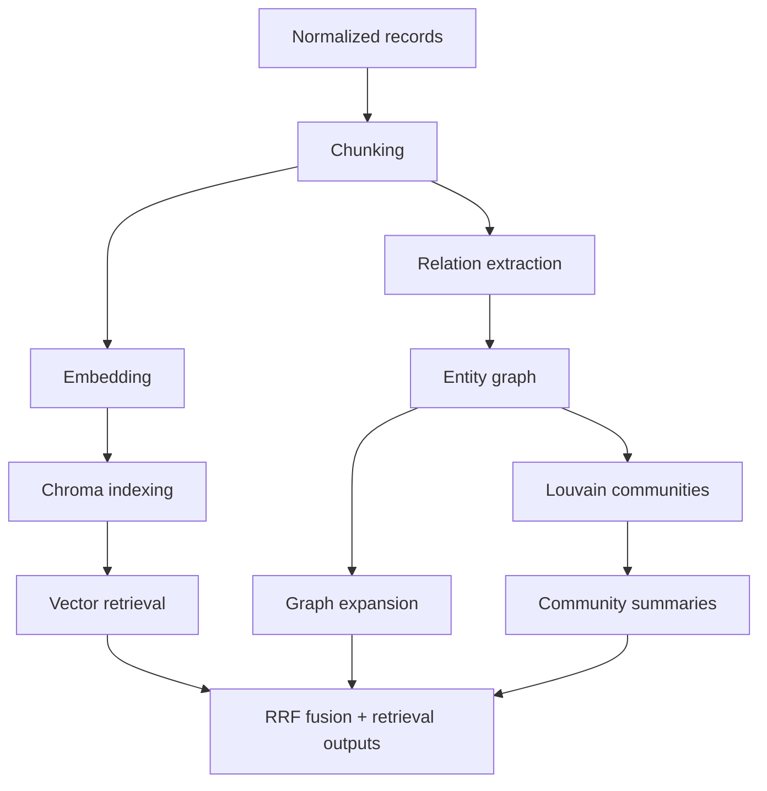

# 02. Chroma GraphRAG

## What is this technique?
**GraphRAG** augments vector retrieval with graph structure (entities, relations, communities) so evidence retrieval is not purely embedding-similarity based.

This notebook builds the local baseline using ChromaDB.

## Definition and core concepts
- **Dense retrieval**: similarity search over chunk embeddings.
- **Entity graph**: UMLS concepts as nodes, co-occurrence/relations as edges.
- **Local search**: neighborhood expansion around query concepts.
- **Global search**: community-level routing using Louvain clusters.

## Why was GraphRAG developed?
Dense-only retrieval can miss relationship structure (e.g., treatment vs cause vs co-occurrence). GraphRAG adds explicit structural signals.

## What limitation of traditional RAG does it solve?
Traditional RAG lacks relational context and concept topology. GraphRAG provides explicit biomedical concept linking and community-level context.

## Architecture/workflow diagram

## How it appears in code
Core modules:
- Chroma indexing/search: `src/chroma_retriever.py`
  - `index_chunks_to_chromadb` (57-84)
  - `vector_search` (93-122)
  - `entity_search` (124-155)
  - `reciprocal_rank_fusion` (157-185)
- Graph build/search: `src/graph_builder.py`
  - `extract_relationship_edges` (276-313)
  - `build_entity_graph` (64-127)
  - `detect_communities` (151-160)
  - `local_graph_expansion` (200-233)
  - `rank_communities_for_query` (235-261)

Notebook implementation:
- `notebooks/NB02_Chroma_GraphRAG.py`

## Component-by-component breakdown
1. Chunking with entity metadata propagation (`src/chunking.py` lines 111-147).
2. Embedding with Ollama (`src/embeddings.py` lines 34-149).
3. Chroma persistence with rich metadata (`src/chroma_retriever.py` lines 26-36, 57-84).
4. Relation extraction heuristics (`src/graph_builder.py` lines 30-47, 276-313).
5. Graph statistics + communities (`src/graph_builder.py` lines 130-197).
6. Retrieval fusion via RRF (`src/chroma_retriever.py` lines 157-185).

## Real outputs from latest artifacts
Graph stats from `outputs/tables/nb02_graph_stats.csv`:
- Nodes: `15,454`
- Edges: `2,191,052`
- Density: `0.01835`
- Largest component: `15,454`

Relation stats from `outputs/tables/nb02_relation_stats.csv`:
- Total relation edges extracted: `4,342,106`
- Relation labels include `associated_with`, `co_occurs_with`, `inhibits`, `causes`, `activates`, `treats`

Community summary from `outputs/tables/nb02_community_summary.csv`:
- Largest communities: sizes `4,809`, `3,984`, `3,844`, `2,739`

## Why ChromaDB here?
- Local persistence, fast iteration, low ops overhead.
- Straightforward metadata retrieval for tutorial transparency.

## Why not FAISS/Weaviate/Qdrant for Section A?
- FAISS: strong ANN core but extra metadata/persistence plumbing required.
- Weaviate/Qdrant: strong production choices but add service runtime overhead for a local-first chapter.

## When should this be used?
- Early-stage prototyping with deep retrieval introspection.
- Scenarios where graph-aware biomedical expansion is required.

## Advantages
- Explainable concept-level retrieval behavior.
- Strong debugging visibility (graph stats, communities, relation labels).
- Reproducible local baseline before managed deployment.

## Disadvantages
- Heuristic relation extraction has precision limits.
- Full-collection metadata scans can be expensive at scale.

## Comparison vs standard dense RAG
- Standard dense RAG: semantic similarity only.
- Chroma GraphRAG: semantic + concept graph + community context.

## Production considerations
- Replace heuristic relation extraction with stronger relation models.
- Track graph drift and refresh schedule.
- Add retrieval latency/error telemetry around vector and graph channels.

## Conclusion
This chapter establishes the structural retrieval baseline the rest of the system builds upon.
