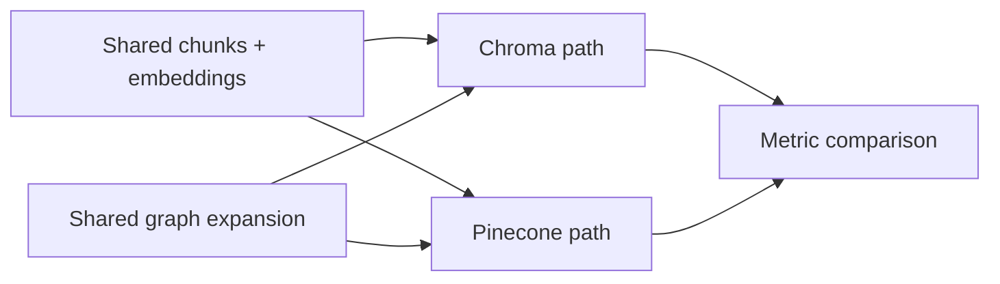

# 03. Pinecone GraphRAG

## What is this technique?
This chapter ports the GraphRAG retrieval workflow to Pinecone and compares it directly with Chroma on the same corpus/chunks/queries.

## Definition and core concepts
- **Managed vector backend**: Pinecone serves vectors over a hosted service.
- **Apples-to-apples benchmark**: same embeddings, same chunk metadata, same graph expansion logic.
- **Cost proxy**: operation counts and vector footprint used as auditable cost drivers.

## Why was this developed?
A local baseline is useful, but production systems often require managed scaling, isolation, and cloud-native operations.

## What limitation of traditional single-backend RAG does it solve?
Single backend choices hide operational tradeoffs. This comparison exposes latency, complexity, and scale posture differences.

## Architecture diagram

## How it appears in code
- Pinecone utilities: `src/pinecone_retriever.py`
  - `create_index` (47-63)
  - `index_chunks_to_pinecone` (76-114)
  - `query_pinecone` (116-153)
  - `pinecone_cost_proxy` (155-195)
- Notebook benchmarking logic: `notebooks/NB03_Pinecone_GraphRAG.py`

## Component breakdown
1. Rehydrate the same artifacts from NB02.
2. Index vectors in Pinecone namespace.
3. Run matched GraphRAG search path in both backends.
4. Compute retrieval metrics and latency distributions.
5. Persist comparison tables/charts.

## Real benchmark outputs
Source files:
- `outputs/metrics/nb03_retrieval_benchmark.json`
- `outputs/tables/nb03_chroma_vs_pinecone.csv`

### Latency
- Chroma: p50 `5973ms`, p95 `6673ms`, p99 `6773ms`
- Pinecone: p50 `9658ms`, p95 `11889ms`, p99 `14087ms`

### Retrieval quality snapshot
- Chroma (`k=8`): precision `0.0417`, recall `0.3000`, MRR `0.2162`, NDCG `0.2324`
- Pinecone (`k=8`): precision `0.0708`, recall `0.5167`, MRR `0.1879`, NDCG `0.2722`

### Cost/scalability proxy
From `nb03_chroma_vs_pinecone.csv`:
- Chroma cost driver: `queries=30, vectors=5098`
- Pinecone cost driver: `queries=30, upserts=5098, vectors=5098`
- Complexity scores: Chroma `2/5`, Pinecone `3/5`
- Scalability scores: Chroma `3/5`, Pinecone `5/5`

## Why Pinecone vs alternatives in this chapter?
- Chosen for managed scaling path and hosted operations.
- Not chosen alternatives in this chapter (self-hosted vector DBs) to keep backend comparison focused and reproducible.

## When should this be used?
- Production environments requiring managed vector serving.
- Teams optimizing for scaling/ops consistency over local simplicity.

## Advantages
- Cloud-managed infrastructure and scale readiness.
- Clear index lifecycle APIs.

## Disadvantages
- Higher observed latency in this run vs local Chroma.
- Requires credentials and cloud dependency.

## Comparison against standard RAG
Standard RAG often fixes one backend and ignores operational tradeoffs. This chapter makes those tradeoffs measurable.

## Production considerations
- Enforce index lifecycle cleanup for spend control.
- Monitor tail latency and retry behavior.
- Keep metadata schema consistent across stores.

## Conclusion
Pinecone integration is fully implemented and benchmarked against Chroma with real artifacts, enabling informed backend decisions.
