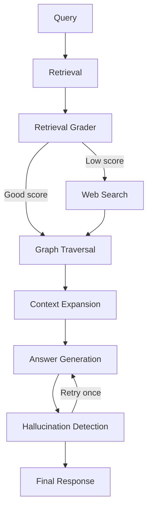

# 04. Agentic GraphRAG (LangGraph)

## What is this technique?
Agentic GraphRAG uses an explicit state graph (LangGraph) to route queries through retrieval, grading, fallback, graph traversal, answer generation, and hallucination checks.

## Definition and core concepts
- **State machine RAG**: deterministic node graph over mutable state.
- **Routing gates**: branches controlled by retrieval and hallucination quality.
- **Traceability**: every node transition is recorded in `trace`.

## Why was this developed?
Linear pipelines cannot adapt when retrieval is weak. Agentic control enables controlled fallback and retry logic.

## What limitation of traditional RAG does it solve?
Traditional RAG has weak conditional behavior and limited observability. Agentic GraphRAG adds explicit branch semantics and replayable traces.

## Workflow diagram

## How it appears in code
`src/agentic_rag.py`:
- State definition: `AgentState` (28-45)
- Workflow builder: `build_agentic_workflow` (182-345)
- Node implementations:
  - retrieval (185-190)
  - retrieval grader (192-197)
  - web fallback (199-202)
  - graph traversal (204-212)
  - context expansion (214-243)
  - answer generation (245-278)
  - hallucination detection (280-295)
  - finalize (297-300)

Notebook:
- `notebooks/NB04_Agentic_GraphRAG.py`

## Component breakdown
1. Retrieve top-k dense docs from Chroma.
2. Judge retrieval quality (`settings.retrieval_grade_threshold`).
3. Route to web fallback if low quality.
4. Expand graph neighborhoods + communities.
5. Generate grounded answer with citations.
6. Judge groundedness/hallucination and optionally retry once.

## Real outputs
- Workflow Mermaid artifact: `outputs/figures/nb04_agent_workflow_mermaid.md`
- Route summary: `outputs/tables/nb04_agentic_route_summary.csv`
- Demo state payload: `outputs/metrics/nb04_agentic_demo.json`

From `nb04_agentic_route_summary.csv`:
- Example query route: `graph_traversal`
- Retrieval score: `0.85`
- Hallucination score: `0.95`

## Why LangGraph over simpler chaining?
- Explicit, inspectable state graph.
- Safer branch control than ad-hoc conditionals.
- Better for audit and debugging.

## When should this be used?
- Biomedical workloads with variable retrieval quality.
- Systems requiring explainable control-flow for safety review.

## Advantages
- Strong observability via trace paths.
- Controlled fallback/retry behavior.
- Clear extension path for additional tools.

## Disadvantages
- More orchestration complexity.
- Extra judge calls increase runtime cost and latency.

## Comparison against other variants
- Standard RAG: fastest, least adaptive.
- Hybrid RAG: better retrieval but no full control graph.
- CRAG: stricter corrective policy specialization.
- Agentic GraphRAG: broader orchestration with graph-aware context.

## Production considerations
- Limit fallback domains for medical safety.
- Add node-level latency and failure telemetry.
- Enforce retry caps and timeout budgets.

## Conclusion
Agentic GraphRAG provides the control-plane layer for reliability and explainability on top of retrieval and graph evidence.
