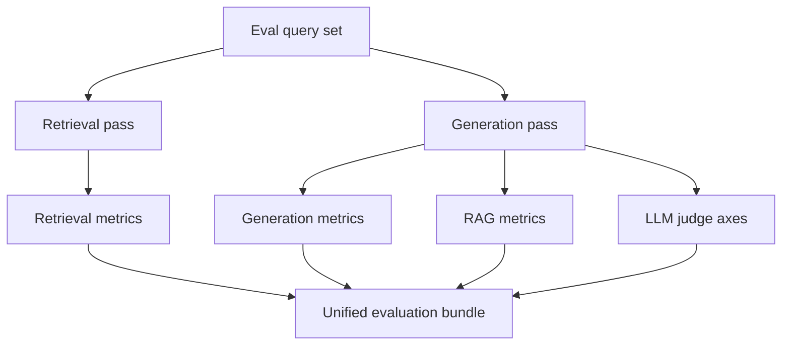

# 05. Evaluation Framework

## What is this technique?
A unified evaluation stack measuring:
- Retrieval quality
- Generation quality
- RAG-specific groundedness quality
- LLM-as-a-Judge quality axes

## Definition and core concepts
### Retrieval metrics
- Precision@K
- Recall@K
- F1@K
- MRR
- NDCG@K

### Generation metrics
- Exact Match
- BLEU
- ROUGE-1/2/L
- METEOR
- BERTScore

### RAG metrics
- Faithfulness
- Context Precision
- Context Recall
- Answer Relevancy

### Judge axes (granite4.1:8b)
- Groundedness
- Relevance
- Hallucination (higher = lower hallucination risk in this implementation)
- Completeness

## Why this framework was developed
Single metrics can hide failure modes. Biomedical RAG needs layered quality checks because retrieval, answer style, and groundedness can diverge.

## What limitation of traditional RAG evaluation does it solve?
Traditional evaluation often measures only lexical overlap. This framework adds retrieval diagnostics and groundedness judgment.

## How it appears in code
Core implementation in `src/evaluator.py`:
- retrieval metrics: lines 64-147
- generation metrics: lines 149-255
- judge-backed RAG metrics: lines 308-456
- unified bundle: lines 459-486

Judge helper module:
- `src/llm_judge.py` (`grade_retrieval_quality`, `grade_groundedness`)

Notebook:
- `notebooks/NB05_Evaluation.py`

## Workflow diagram

## Real outputs and values
Primary artifacts:
- `outputs/metrics/nb05_evaluation_bundle.json`
- `outputs/tables/nb05_metric_summary.csv`
- `outputs/tables/nb05_sample_agent_outputs.csv`

From latest `nb05_evaluation_bundle.json`:
- Retrieval (`k=8`): precision `0.0417`, recall `0.3000`, f1 `0.0726`, ndcg `0.2324`, mrr `0.2162`
- Generation: exact_match `0.0`, bleu `0.0126`, rouge1 `0.1420`, meteor `0.1626`
- RAG: faithfulness `0.9458`, context_precision `0.2307`, context_recall `0.2167`, answer_relevancy `0.9833`
- Judge axes: groundedness `4.4167`, relevance `5.0`, hallucination `5.0`, completeness `3.75`

## Interpretation of observed metrics
- Retrieval has room for improvement at high-K precision.
- Lexical generation metrics are modest, which is common in biomedical paraphrastic answers.
- Judge-based groundedness/relevance are relatively strong in this run.

## Advantages
- Multi-perspective quality measurement.
- Unified bundle for regression tracking.
- Judge + deterministic metrics together reduce blind spots.

## Disadvantages
- Judge metrics add runtime and potential evaluator variance.
- BERTScore can fail/fallback in constrained environments.

## Comparison against standard evaluation
- Standard: often ROUGE/BLEU only.
- This project: retrieval + generation + RAG + judge in one contract.

## Production considerations
- Keep eval set versioned and non-synthetic.
- Track trends per release, not single-point values.
- Add slice-based reporting (rare terms, long-tail diseases, modality-specific queries).

## Conclusion
This framework turns pipeline behavior into measurable, auditable signals needed for iteration and production gating.
