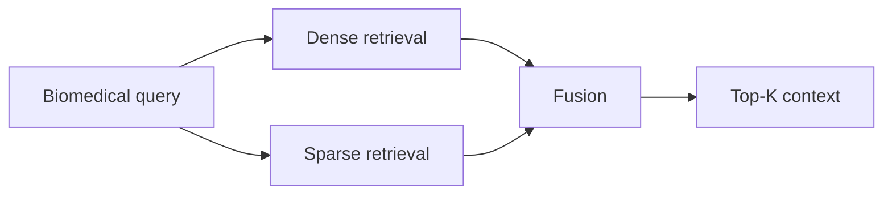

# 06. Hybrid RAG (Dense + Sparse Biomedical Retrieval)

## What is this technique?
Hybrid RAG combines:
- dense semantic retrieval (`qwen3-embedding:4b` via Chroma), and
- sparse lexical retrieval (BM25-style index with biomedical abbreviation expansion)

then fuses both channels into one ranking.

## Definition and core concepts
- **Dense retrieval**: semantic nearest-neighbor similarity.
- **Sparse retrieval**: lexical term matching and BM25 scoring.
- **Fusion**: weighted normalized score merge or RRF.

## Why was this developed?
Biomedical text has both semantic and exact lexical signals (gene names, abbreviations, biomarkers). Dense-only or sparse-only retrieval misses part of this signal.

## What limitation of traditional RAG does it solve?
Traditional dense-only RAG can miss exact biomedical terms; sparse-only can miss paraphrases. Hybrid reduces both failure modes.

## Architecture diagram

## How it appears in code
`src/hybrid_retriever.py`:
- Biomedical tokenization: `_tokenize` (30-33)
- Abbreviation expansion map: `BIOMED_ABBREVIATION_MAP` (35-42)
- Sparse index class: `BiomedicalSparseIndex` (55-163)
- Fusion: `weighted_score_fusion` (165-219)
- End-to-end search: `hybrid_search` (221-248)

Notebook:
- `notebooks/NB06_Hybrid_RAG.py`

## Component breakdown
1. Build sparse index from chunk text.
2. Query dense and sparse channels.
3. Fuse via normalized weighted scores (`settings.hybrid_dense_weight`, `settings.hybrid_sparse_weight`) or optional RRF.
4. Evaluate across retrieval/generation/RAG/judge metrics.

## Real outputs
- Metrics: `outputs/metrics/nb06_hybrid_rag_metrics.json`
- Summary table: `outputs/tables/nb06_hybrid_rag_summary.csv`

Latest key values:
- Retrieval (`k=8`): precision `0.0625`, recall `0.4500`, MRR `0.3931`, NDCG `0.4101`
- RAG: faithfulness `0.7667`, answer_relevancy `0.7833`
- Judge retrieval quality sample: `0.3` (with missing-aspects rationale in metrics JSON)

## Interpretation
Compared to baseline NB05 retrieval (`recall@8=0.3000`, `MRR=0.2162`), hybrid shows higher recall and MRR in this run.

## Why this design over alternatives?
- Weighted fusion is transparent and tunable.
- RRF remains available when score scales are incomparable.

## When should this be used?
- Biomedical corpora with abbreviations, acronyms, and exact terminology.
- Systems where dense-only retrieval underperforms on lexical precision.

## Advantages
- Better lexical-semantic balance.
- Uses existing Chroma infrastructure.
- Simple to inspect and tune.

## Disadvantages
- Extra index and tuning overhead.
- Potential latency increase from dual retrieval channels.

## Comparison against implemented variants
- Standard GraphRAG: strong structure, weaker lexical compensation.
- Hybrid: retrieval quality booster layer.
- CRAG: correction layer on top when retrieval still weak.

## Production considerations
- Track query cohorts where sparse contributes most.
- Version and monitor fusion weights.
- Rebuild sparse index when corpus updates.

## Conclusion
Hybrid retrieval is a practical middle-ground improvement before moving to heavier reranking architectures.
