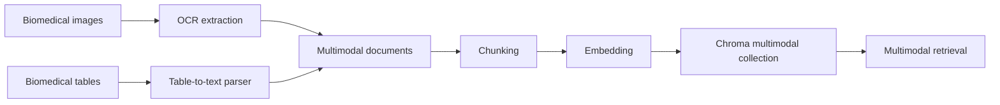

# 08. Multimodal RAG (OCR + Tables)

## What is this technique?
Multimodal RAG extends text RAG by converting images and tables into retrievable text evidence.

In this project:
- image evidence is extracted via `glm-ocr` (CLI-first with fallback),
- table evidence is converted to structured narrative text,
- all evidence is indexed in Chroma and evaluated like other RAG variants.

## Definition and core concepts
- **Multimodal document**: text extracted from image/table with provenance metadata.
- **Multimodal chunk**: retrievable chunk from extracted evidence.
- **Provenance**: source path, modality, backend, model recorded in metadata.

## Why was this developed?
Biomedical findings are often in plots and tables, not only prose. Text-only RAG can miss this evidence.

## What limitation of traditional RAG does it solve?
Traditional RAG ignores non-text evidence by default. Multimodal ingestion captures chart/table signals as retrieval context.

## Architecture diagram

## How it appears in code
- Asset acquisition: `src/multimodal_assets_pmc.py`
  - fetches real open biomedical/health datasets and builds assets (285-348)
- OCR and multimodal ingestion: `src/multimodal_rag.py`
  - OCR wrapper: `extract_text_with_glm_ocr_with_backend` (89-164)
  - table parser: `table_to_biomedical_text` (185-224)
  - document builder: `build_multimodal_documents` (227-297)
  - indexing/search: `index_multimodal_chunks_to_chromadb` (336-362), `multimodal_vector_search` (364-391)

Notebook:
- `notebooks/NB08_Multimodal_RAG.py`

## Component breakdown
1. Fetch/build multimodal assets and manifest.
2. OCR image assets, parse table assets.
3. Build multimodal docs and chunks.
4. Index in dedicated multimodal collection.
5. Run retrieval/generation/RAG/judge evaluation.

## Real outputs
- Metrics: `outputs/metrics/nb08_multimodal_rag_metrics.json`
- Table summary: `outputs/tables/nb08_multimodal_rag_summary.csv`

Latest key values:
- Retrieval (`k=8`): precision `0.1250`, recall `1.0000`, MRR `1.0000`, NDCG `1.0000`
- Generation: BLEU `0.0184`, ROUGE-1 `0.1591`, METEOR `0.2612`
- RAG: faithfulness `0.8875`, answer_relevancy `0.9375`
- Asset counts: images `5`, tables `3`, documents `8`, chunks `8`, eval queries `8`

## Why this design vs alternatives?
- OCR+table conversion is transparent and auditable.
- It integrates with existing text retrieval stack without replacing infrastructure.

## When should this be used?
- Chart-heavy/table-heavy biomedical QA tasks.
- Use cases requiring numeric trend/context evidence.

## Advantages
- Brings visual/tabular evidence into standard RAG pipeline.
- Maintains provenance and retrieval traceability.

## Disadvantages
- OCR noise and preprocessing complexity.
- Quality depends on image/table quality and parsing robustness.

## Comparison against other variants
- NB08 provides general multimodal baseline.
- NB09 specializes operational OCR pathway.
- NB10 specializes non-text visual semantics via vision model.

## Production considerations
- Version extracted text with source assets.
- Add OCR quality checks and confidence filters.
- Enforce data governance for sensitive medical assets.

## Conclusion
Multimodal ingestion materially expands available evidence beyond text-only abstracts and improves retrieval coverage in visual/table scenarios.
