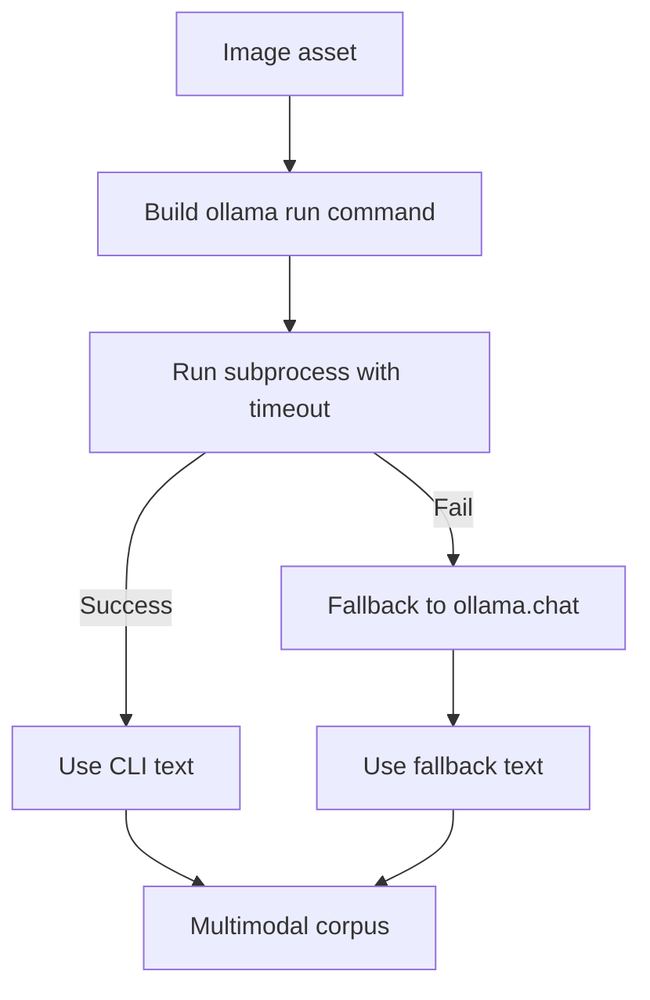

# 09. Multimodal RAG (CLI OCR Specialization)

## What is this technique?
This chapter focuses on a **CLI-first OCR operational pattern**:
- primary path: `ollama run glm-ocr`
- fallback path: `ollama.chat` only on CLI failure

The goal is operational transparency and reproducibility of OCR execution.

## Definition and core concepts
- **CLI-first extraction**: OCR executed as subprocess with explicit command and timeout.
- **Backend provenance**: each asset stores whether extraction came from CLI or fallback.
- **Bounded fallback**: retry-controlled recovery path.

## Why was this developed?
Shell-driven data pipelines often require explicit commands, logs, and retry policies. CLI-first OCR is easier to audit in those environments.

## What limitation of standard multimodal RAG does it solve?
API-only extraction can hide operational details. CLI-first execution makes OCR behavior explicit and easier to monitor.

## Workflow diagram

## How it appears in code
`src/multimodal_rag.py`:
- CLI command builder: `_glm_ocr_cli_command` (72-86)
- CLI + fallback executor: `extract_text_with_glm_ocr_with_backend` (89-164)
- wrapper: `extract_text_with_glm_ocr` (167-182)

Notebook:
- `notebooks/NB09_Multimodal_RAG_OCR_CLI.py`

## Component breakdown
1. Build deterministic `ollama run` command.
2. Execute with timeout and return-code checks.
3. Route to fallback only when needed.
4. Persist backend metadata with each multimodal document.

## Real outputs
- Metrics: `outputs/metrics/nb09_multimodal_ocr_cli_metrics.json`
- Summary table: `outputs/tables/nb09_multimodal_ocr_cli_summary.csv`

Latest key values:
- Retrieval (`k=8`): precision `0.1250`, recall `1.0000`, MRR `1.0000`, NDCG `1.0000`
- RAG: faithfulness `1.0000`, answer_relevancy `1.0000`
- Judge axes: groundedness/relevance/hallucination/completeness all `5.0`
- Config notes recorded in artifact:
  - `ocr_model=glm-ocr`
  - `ocr_cli_timeout_seconds=120`
  - `ocr_cli_allow_fallback=true`

## Why this design over alternatives?
- Explicit subprocess behavior is easier to debug than opaque API-only behavior.
- Fallback preserves robustness without making fallback the default path.

## When should this be used?
- Shell-oriented ETL pipelines.
- Teams requiring command-level OCR auditability.

## Advantages
- Strong operational visibility.
- Controlled failure/recovery behavior.

## Disadvantages
- More subprocess orchestration complexity.
- Requires careful timeout and retry policy tuning.

## Comparison with other multimodal variants
- NB08: broader multimodal baseline.
- NB09: operational OCR reliability focus.
- NB10: vision semantics focus beyond OCR text extraction.

## Production considerations
- Log per-asset backend route (`ollama_run` vs fallback).
- Track timeout/failure rates as quality signals.
- Keep OCR model/version pinned for reproducibility.

## Conclusion
CLI-first OCR provides a practical and auditable multimodal ingestion mode for production-like pipelines.
