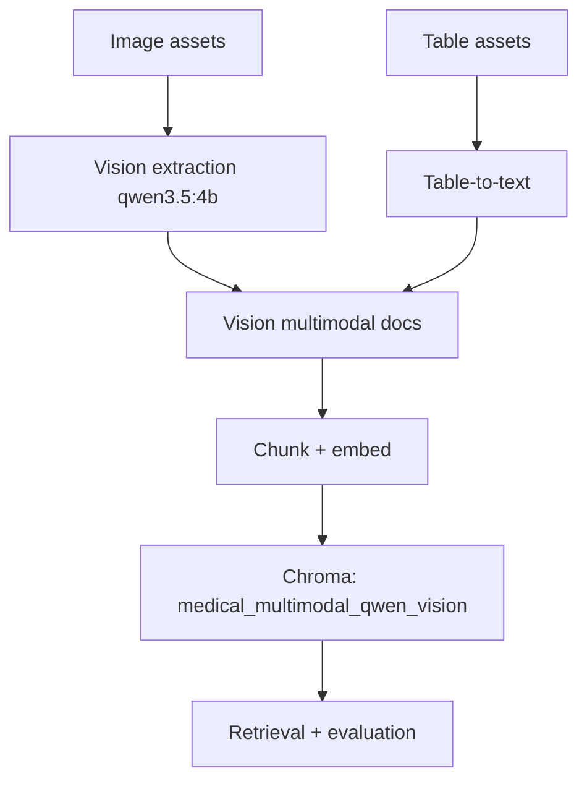

# 10. Multimodal RAG (Vision with `qwen3.5:4b`)

## What is this technique?
A second multimodal pipeline that extracts biomedical evidence from images using a vision model (`qwen3.5:4b`) instead of OCR-only extraction.

## Definition and core concepts
- **Vision extraction**: model interprets visual structure and trends, not only visible text.
- **Vision-derived evidence**: output is converted to retrievable text chunks.
- **Collection isolation**: vision outputs are indexed in a dedicated collection for clean comparison.

## Why was this developed?
OCR captures visible text but can miss chart semantics (trend direction, visual progression, subgroup patterns).

## What limitation of traditional/multimodal OCR-only RAG does it solve?
It captures non-verbatim visual meaning that text-only and OCR-only paths may miss.

## Workflow diagram

## How it appears in code
`src/multimodal_vision_rag.py`:
- Vision extraction call: `extract_vision_evidence_with_qwen` (35-84)
- Document builder: `build_vision_multimodal_documents` (87-144)
- Retrieval wrapper: `vision_multimodal_search` (174-183)

Notebook:
- `notebooks/NB10_Multimodal_RAG_Vision_Qwen.py`

## Component breakdown
1. Discover assets from `data/multimodal/images` and `data/multimodal/tables`.
2. Extract image semantics via `ollama.chat` using vision model.
3. Convert tables to text.
4. Chunk/index in dedicated vision collection.
5. Evaluate with same metric families as other chapters.

## Real outputs
- Metrics: `outputs/metrics/nb10_multimodal_qwen_vision_metrics.json`
- Summary: `outputs/tables/nb10_multimodal_qwen_vision_summary.csv`

Latest key values:
- Retrieval (`k=8`): precision `0.1667`, recall `1.0000`, MRR `1.0000`, NDCG `1.0000`
- RAG: faithfulness `0.9875`, context_recall `1.0000`, answer_relevancy `0.9750`
- Judge axes: groundedness `4.75`, relevance `5.0`, hallucination `5.0`, completeness `5.0`

## Why this design over alternatives?
- Keeps multimodal architecture consistent while swapping only extraction strategy.
- Enables direct OCR-vs-vision comparison without changing downstream evaluation.

## When should this be used?
- Figure-heavy medical tasks where trend/shape interpretation matters.
- Cases where OCR text is sparse but visual pattern is strong.

## Advantages
- Captures non-textual visual semantics.
- Shares same retrieval/evaluation contracts with other variants.

## Disadvantages
- More prompt-sensitive than OCR.
- Potentially higher inference cost and latency.

## Comparison with implemented variants
- NB09 excels in operational OCR traceability.
- NB10 excels when chart semantics matter beyond visible text.

## Production considerations
- Version prompts and extraction templates.
- Monitor vision extraction drift and hallucination risk.
- Keep separate benchmark suites for OCR and vision paths.

## Conclusion
The vision pathway broadens evidence capture for visual biomedical signals and complements OCR-based multimodal retrieval.
