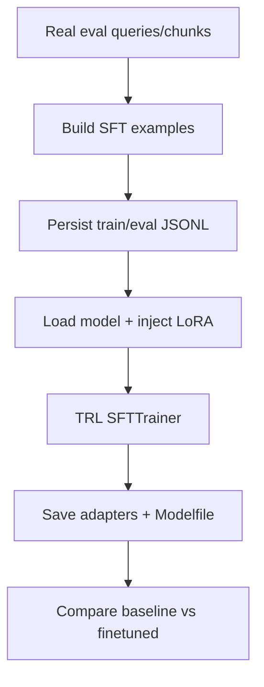

# 11. Selective Fine-Tuning (Unsloth + PEFT + TRL)

## What is this technique?
Selective fine-tuning is an optional quality-improvement path that adapts the generator model using parameter-efficient adapters instead of full model retraining.

## Definition and core concepts
- **Unsloth**: efficient model-loading/training runtime for adapter workflows.
- **PEFT (LoRA)**: train small adapter parameters while keeping base model mostly frozen.
- **TRL (SFTTrainer)**: standardized supervised fine-tuning trainer loop.

## Why was this developed?
Full-model fine-tuning is expensive and operationally heavy. This stack exists to make adaptation cheaper and more practical.

## What limitation of traditional RAG does it solve?
Even with strong retrieval, generation style and policy adherence may still be weak. Selective fine-tuning targets generator behavior without redesigning retrieval architecture.

## Why these tools were used in this project
- Unsloth: selected as preferred efficient path when compatible.
- PEFT: required for adapter-based fine-tuning (lower compute/memory than full fine-tune).
- TRL: used for trainer abstraction and reproducible SFT config.

## Where they are used in code
- Dataset construction: `src/finetune_data.py`
  - `build_biomedical_sft_examples` (56-111)
  - `persist_sft_jsonl` (149-187)
- Training utilities: `src/finetune_unsloth.py`
  - stack checks: `finetune_stack_status` (21-25)
  - Unsloth path: `create_unsloth_lora_model` (114-143)
  - PEFT fallback: `create_peft_lora_model_fallback` (145-184)
  - TRL trainer factory: `create_sft_trainer` (201-283)

Notebook implementation:
- `notebooks/NB11_Selective_Finetuning_Unsloth_PEFT_TRL.py`

## Workflow diagram

## What changed because of this implementation
- Added an optional end-to-end fine-tuning path without modifying baseline retrieval/agentic pipelines.
- Added SFT dataset and adapter artifact outputs under `outputs/finetune/`.
- Added NB11 metrics/report schema to keep comparisons consistent with other chapters.

## Real observed outputs (latest run)
Primary artifact:
- `outputs/metrics/nb11_selective_finetune_metrics.json`

Latest values from that file:
- `mode: executed`
- `stack.unsloth/peft/trl: true`
- dataset sizes: `train=2500`, `eval=300`
- training config base model: `unsloth/llama-3.2-3b-instruct`
- `trainer_log_summary.status: failed`
- error: `'LlamaAttention' object has no attribute 'apply_qkv'`
- `comparison_payload.mode: placeholder` (no deltas populated)

Additional observed artifact state:
- `outputs/finetune/adapters/medresearch-lora/` contains adapter files timestamped **June 21, 2026**, with metadata referencing `sshleifer/tiny-gpt2`.
- This indicates historical adapter artifacts exist, but the **latest June 22 metrics artifact** reports a failed training backend and no updated comparison deltas.

## How this affected post-run results
From the latest metrics artifact:
- No reliable baseline-vs-finetuned delta was produced (all delta fields null in `comparison_payload`).
- Therefore, no measured quality improvement can be claimed from the latest run.

## Performance/efficiency/quality impact in this run
- Efficiency intent: adapter tuning instead of full-model training.
- Actual latest run outcome: training backend incompatibility, so no post-run quality gain was measured.

## Advantages
- Keeps fine-tuning optional and isolated.
- Adapter-based path is lower-cost than full model tuning.
- Preserves baseline architecture unchanged.

## Disadvantages
- Compatibility risks across model/runtime combinations.
- Additional lifecycle burden (training infra, adapter governance, regression checks).

## Comparison against other implemented variants
- Hybrid/CRAG/multimodal improve retrieval/context behavior.
- NB11 targets generator adaptation and should be used only after retrieval quality is stable.

## Production considerations
- Treat adapter builds as versioned deployable artifacts.
- Add strict regression gates before replacing baseline generator.
- Keep rollback path to baseline generator always available.

## Official references used
- Unsloth: https://github.com/unslothai/unsloth
- PEFT: https://huggingface.co/docs/peft/index
- TRL: https://huggingface.co/docs/trl/index

## Conclusion
The selective fine-tuning pipeline is implemented and integrated, but the latest execution artifact records a trainer compatibility failure, so final quality deltas are not available for that run.
