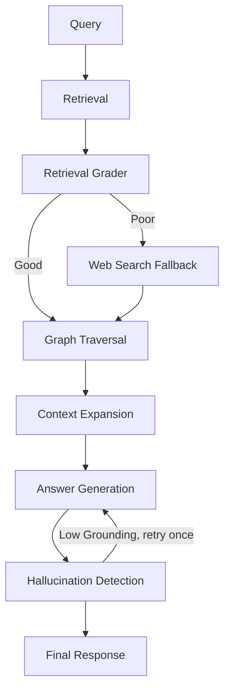

```mermaid
flowchart TD
    A[Query] --> B[Retrieval]
    B --> C[Retrieval Grader]
    C -->|Poor| D[Web Search Fallback]
    C -->|Good| E[Graph Traversal]
    D --> E
    E --> F[Context Expansion]
    F --> G[Answer Generation]
    G --> H[Hallucination Detection]
    H -->|Low Grounding, retry once| G
    H --> I[Final Response]
```
